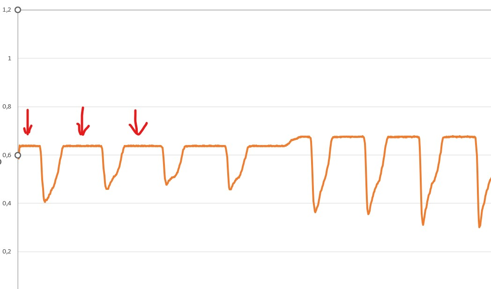
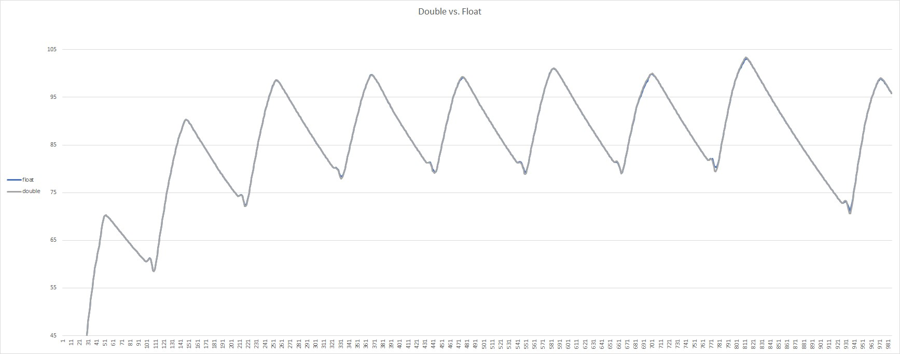

# ESP32 Rowing Monitor

## Aim of the project

The purpose of this project is to provide capabilities similar to the [Open Rowing Monitor Project](https://github.com/laberning/openrowingmonitor)(ORM) but with the ESP32 microcontroller. The math and algorithm used in ESP Rowing Monitor are based on the approach developed by JaapvanEkris that improves the stroke detection algorithm of the original ORM.

The choice to the ESP32 was made instead of the Rpi due to its smaller size, its operability completely from battery, its very low cost, and easy accessibility.

There is a lot of information available on the physics and math behind the code in the repos related to ORM. Before using this project I recommend reading the documentation of ORM (specifically the docs provided currently under the [v1beta branch](https://github.com/laberning/openrowingmonitor/tree/v1beta)) as this would greatly help with setting up and tuning in the settings of ESP Rowing Monitor.

## Technical details

The monitor works by detecting the speed of the rotating flywheel via measuring the time between impulses through a reed or hall sensor on the rowing machine (more on the physics [here](https://github.com/laberning/openrowingmonitor/blob/v1beta/docs/physics_openrowingmonitor.md)).

Please note that for this monitor to work, one really needs to measure the rotation speed of the flywheel rather than the speed of the handle being pulled. There are [several discussions](https://github.com/laberning/openrowingmonitor/discussions/95) on this topic under the ORM repos. It is possible that one can make it work but I have not tested such setup. I recommend reading those discussions to better understand the consequences of not measuring the flywheel speed.

### Impulse detection

All the metrics calculated are based on measuring the time between two consecutive impulses. Time is registered via an interrupt that is triggered by the reed/hall sensor connected to the ESP32 MCU. Basically, the ISR gets the current timestamp in microseconds and calculates the delta since the previous interrupt (as well as counts the number of times the ISR is triggered). This information is then fed into the stroke detection algorithm.

One advantage of the ESP32 ISR is that it is real-time (compared to ORM's polling strategy), which in theory would make this solution more accurate. However, testing showed that any deviation of the data produced by ORM and ESP Rowing Monitor is within the margin of error. So there is no real evidence that this added accuracy can be translated into an apparent improvement of the data quality. Actually, due to some noise filtering that ORM has, ORM may be a better choice for certain setups (mostly machines that produce quite some noise).

This project uses the same [Theil Sen Quadratic Regression](https://github.com/laberning/openrowingmonitor/blob/v1beta/docs/physics_openrowingmonitor.md#a-mathematical-perspective-on-key-metrics) model to determine torque as ORM, which is used as the main stroke detection algorithm. This is supplemented with a secondary fallback algorithm that uses a different approach compared to the way ORM tackles this. This secondary algorithm fits a linear regression curve to the calculated slopes of the recovery regression lines for every "flank" (i.e., it looks for the slope of slopes on every impulse). The slope of slopes calculated from the data points within a "flank" (once there is no power provided to the flywheel by the rower) becomes flat within a margin as the deceleration of the flywheel becomes fairly constant.



The secondary algorithm looks for the moment when the slope of slopes flatlines (again, within a margin set by the user).

Please note that due to the difference between the Rpi and the ESP32 (including but not limited to the CPU power, flash size, etc.), certain limitations and constraints apply to this project. Please see the limitations section for further details.

## Features

ESP Rowing Monitor provides several ways to get the data and metrics it measures

### Bluetooth

ESP Rowing Monitor supports two BLE profiles:

1. Cycling Speed and Cadence Sensor profile
2. Power Meter Sensor profile

Switching between the profiles can be done through the WebGUI or via BLE Control Point using a specific OpCode (18). The implementation of these profiles complies with BLE standards, although the OpCode used is not standard.

Both BLE profiles are fully compliant with BLE standards, making them accessible by compatible devices such as smartwatches. They have been tested with Garmin smartwatches, including FR235, FR645, and FR255.

Please note that in order for Garmin watches to work with ESP Rowing Monitor, a cycling activity must be selected. Otherwise, due to limitations of Garmin, the watch will connect but will not use the sensor data for metrics.

To obtain accurate speed and distance data, the wheel circumference must be set to 10mm when pairing the device with ESP Rowing Monitor.

### Web interface

ESP Rowing Monitor includes a WebSocket server that sends calculated metrics to connected clients (up to a maximum of 2 clients at a time). The data is sent in JSON format and follows the structure shown below:

```typescript
{
    driveDuration: number;
    recoveryDuration: number;
    batteryLevel: number;
    bleServiceFlag: BleServiceFlag;
    logLevel: LogLevel;
    revTime: number;
    distance: number;
    strokeTime: number;
    strokeCount: number;
    avgStrokePower: number;
    dragFactor: number;
    handleForces: Array<number>;
}
```

Due to resource constraints of the ESP32 MCU, data is only sent on every stroke or every 4 seconds, whichever occurs earlier. This is not a significant issue, as most of the metrics are only available at certain known states of the rowing cycle (e.g. end of drive, end of recovery, etc.).

Currently, a simple WebGUI is being developed using Angular. The related repository can be found [here](https://github.com/Abasz/ESPRowingMonitor-WebGUI). Instructions on how to use/install the WebGUI can be found in the repository's readme.

### Logging

ESP Rowing Monitor implements a logging mechanism with different log levels (e.g. silent, error, info, trace, verbose, etc.). These logs are sent via serial (UART0) only, so the ESP32 MCU should be connected via USB to view the logs. The log level (0-6) can be set via the WebSocket or BLE Control Point using OpCode 17.

T-race level logging is useful during the initial calibration process as it prints the delta times that can be used for replay. Further details can be found in the [Calibration](docs/settings.md#calibration)

### Metrics

Currently, ESP Rowing Monitor is capable of calculating the following metrics, similar to ORM:

- _driveDuration_ and _recoveryDuration_
- _drive length (under development)_
- _average cycle power_
- _distance_
- _stroke rate_
- _handle forces for the drive phase_
- _peak force for the drive phase_
- _speed and pace_

ESP Rowing Monitor may not directly provide certain metrics such as caloric burn, heart rate, VO2max, etc. due to limitations of the device. These metrics require additional sensors or calculations that may not be supported by ESP Rowing Monitor's hardware or software capabilities. Users should refer to the [Limitations](#limitations) section for more detailed information on which metrics may not be available directly from ESP Rowing Monitor.

## Settings

Please see dedicated [settings page](docs/settings.md)

## Installation

Please see dedicated [installation page](docs/installation.md)

## Limitations

The ESP Rowing Monitor has several limitations that users should be aware of.

### CPU power and resource limitation of ESP32 chip

The ESP32 chip is available in a single core or dual core version with a clock speed of 240MHz. I recommend using the dual core (as the tests were done on dual core ESP32). Nevertheless, currently only the web server runs on the secondary core.

The algorithm used for calculating the necessary data for stroke detection can become rather CPU hungry. In a nutshell, the issue is that the Theil-Sen Quadratic Regression is O(N&#178;), which means that as the size of the `IMPULSE_DATA_ARRAY_LENGTH` increases, the time required to complete the calculations increases exponentially (for more information, please see [this explanation](https://github.com/laberning/openrowingmonitor/blob/v1beta/docs/physics_openrowingmonitor.md#use-of-quadratic-theil-senn-regression-for-determining-%CE%B1-and-%CF%89-based-on-time-and-%CE%B8)).

I conducted some high-level tests and measured the execution times, which are shown in the table below:

|IMPULSE_DATA_ARRAY_LENGTH|Execution time (us)|
|:-----------------------:|:----------------:|
|18                       |10319.02324       |
|15                       |7238.056122       |
|12                       |5032.933107       |
|9                        |3252.230726       |
|8                        |2656.080499       |
|7                        |2248.905896       |
|6                        |1903.043651       |
|5                        |1556.085034       |
|3                        |987.0181406       |

The above table shows that with an `IMPULSE_DATA_ARRAY_LENGTH` size of 18, the total execution time of the calculations on every impulse is more than 10ms. This could cause issues, for instance, when a new impulse comes in before the previous calculation is finished. Due to this, currently, the compiler does not allow an `IMPULSE_DATA_ARRAY_LENGTH` size higher than 15 and gives a warning at 12.

As an example, on my setup, I use 3 impulses per rotation. Based on my experience, the delta times cannot dip below 10ms. So with an `IMPULSE_DATA_ARRAY_LENGTH` size of 7 (execution time with double is approximately 2.2ms), this should be pretty much fine.

If, for some reason, testing shows that a higher value for the `IMPULSE_DATA_ARRAY_LENGTH` size is necessary, the execution time can be reduced to some extent if variable types float are used instead of double:

|IMPULSE_DATA_ARRAY_LENGTH|Execution time (us)|
|:-----------------------:|:-----------------:|
|18                       |6943.947846        |
|15                       |5101.781746        |
|12                       |3706.609977        |
|9                        |2543.750567        |
|8                        |2152.922336        |
|7                        |1848.677438        |
|6                        |1602.282313        |
|5                        |1350.632653        |
|3                        |899.649093         |

Using float precision instead of double precision, of course, reduces the precision but shaves off the execution times. I have not run extensive testing on this, but for the limited simulations I run, this did not make a significant difference.

The below picture shows that the blue chart cuts some corners but generally follows the same curve (which does not mean that in certain edge cases the reduced precision does not create errors).



Another limitation related to CPU speed is the refresh rate of the peripherals such as BLE and the web server. The refresh rate is intentionally limited to conserve resources. For example, the web server only updates on a new stroke or after a 4-second interval if no new stroke detected during this period.

Further tests will be needed to determine if this refresh rate can be increased, such as updating on every full rotation. However, this may only be feasible on dual-core versions of the ESP32 chip.

### Noise filtering

Unlike ORM, the ESP Rowing Monitor has limited noise filtering capabilities. ESP Rowing Monitor implements only one impulse noise filter. This is based on the minimum required time between impulses. This means that the hardware used for sensing should produce clean impulses, and read switches with debounce may not yield accurate results. However, if the impulses per revolution are low (e.g. 1), and the minimum time between impulses can be set to a sufficiently high value, it may still work.

Please see [Sensor signal filter settings](docs/settings.md#sensor-signal-filter-settings) for more details.

### BLE and connectivity

The ESP Rowing Monitor does not support heart rate monitors directly, but it may be possible to add heart rate monitor capabilities through the WebGUI using the browser BLE API. However, it may not make much sense to do so.

The ESP Rowing Monitor is unlikely to support ANT+ protocol, as setting up the necessary hardware (ANT+ radio) has proven to be challenging and no success has been achieved in loading the ANT network processor firmware on tested chips.

The ESP Rowing Monitor exposes BLE Cycling Power Profile and Cycling Speed and Cadence Profile, which is a workaround. The wheel circumference should be set to 10mm in order for clients to show correct metrics (please see [this](docs/settings.md#) for more information). Note that in some cases, such as with Garmin watches, the data from these profiles may only show up if the activity is set as cycling, and may not work with Garmin rowing activity profile. Manual activity type change may be needed for certain devices, such as Garmin FR255.

## Backlog

- Make WebGUI served up by ESP Rowing Monitor - In progress
- Need to improve and extend validation of settings on compiling
- Enable disabling peripherals with compiler flags

## Attribution

[Lars Berning](https://github.com/laberning/) - Original ORM implementation

[Jaap van Ekris](https://github.com/JaapvanEkris) - Lots of help and explanation on the background and inner workings of the upgraded stroke detection algorithm
