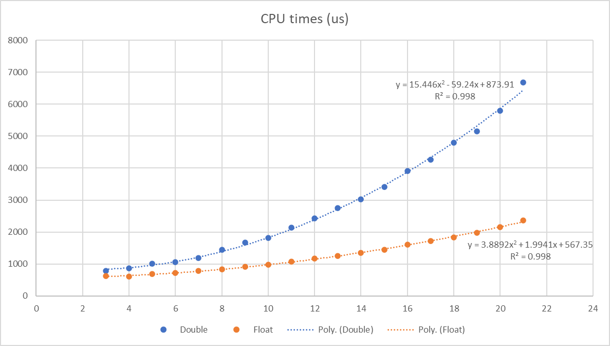

# ESP32 Rowing Monitor

## Aim of the project

The purpose of this project is to provide capabilities similar to the [Open Rowing Monitor Project](https://github.com/laberning/openrowingmonitor) (ORM) but with the ESP32 microcontroller. The math and algorithm used in ESP Rowing Monitor are based on the approach developed by JaapvanEkris that improves the stroke detection algorithm of the original ORM.

The choice to the ESP32 was made instead of the Rpi due to its smaller size, its operability completely from battery, its very low cost, and easy accessibility.

There is a lot of information available on the physics and math behind the code in the repos related to ORM. Before using this project I recommend reading the documentation of ORM (specifically the docs provided currently under the [v1beta_updates branch](https://github.com/JaapvanEkris/openrowingmonitor/tree/v1beta_updates)) as this would greatly help with setting up and tuning in the settings of ESP Rowing Monitor.

## Technical details

The monitor works by detecting the speed of the rotating flywheel via measuring the time between impulses through a reed or hall sensor on the rowing machine (more on the physics [here](https://github.com/laberning/openrowingmonitor/blob/v1beta/docs/physics_openrowingmonitor.md)).

Please note that for this monitor to work, one really needs to measure the rotation speed of the flywheel rather than the speed of the handle being pulled. There are [several discussions](https://github.com/laberning/openrowingmonitor/discussions/95) on this topic under the ORM repos. It is possible that one can make it work but I have not tested such setup. I recommend reading those discussions to better understand the consequences of not measuring the flywheel speed.

### Impulse detection

All the metrics calculated are based on measuring the time between two consecutive impulses. Time is registered via an interrupt that is triggered by the reed/hall sensor connected to the ESP32 MCU. Basically, the ISR gets the current timestamp in microseconds and calculates the delta since the previous interrupt (as well as counts the number of times the ISR is triggered). This information is then fed into the stroke detection algorithm.

One advantage of the ESP32 ISR is that it is real-time (compared to ORM's polling strategy), which in theory would make this solution more accurate. However, testing showed that any deviation of the data produced by ORM and ESP Rowing Monitor is within the margin of error. So there is no real evidence that this added accuracy can be translated into an apparent improvement of the data quality. Actually, due to some noise filtering that ORM has, ORM may be a better choice for certain setups (mostly machines that produce quite some noise).

This project by default uses the same [Theil Sen Quadratic Regression](https://github.com/laberning/openrowingmonitor/blob/v1beta/docs/physics_openrowingmonitor.md#a-mathematical-perspective-on-key-metrics) model to determine torque as ORM, which is used as the main stroke detection algorithm. This is supplemented with a secondary fallback algorithm that uses a different approach compared to the way ORM tackles this. This secondary algorithm fits a linear regression curve to the calculated slopes of the recovery regression lines for every "flank" (i.e., it looks for the slope of slopes on every impulse). The slope of slopes calculated from the data points within a "flank" (once there is no power provided to the flywheel by the rower) becomes flat within a margin as the deceleration of the flywheel becomes fairly constant.


The default secondary algorithm looks for the moment when the slope of slopes flatlines (again, within a margin set by the user).

Nevertheless, for certain machines (based on experience where only 1 or 2 impulses per rotation is present), the user can select the traditional stroke detection algorithm. There are three options in this respect:

1) the more advanced torque based with the slope of slope as secondary algorithm (recommended for machines capable of producing several impulses per rotation),
2) the slope based (that is basically the traditional acceleration and deceleration base method), or
3) use both at the same time

Please note that due to the difference between the Rpi and the ESP32 (including but not limited to the CPU power, flash size, etc.), certain limitations and constraints apply to this project. Please see the limitations section for further details.

## Features

### Bluetooth

ESP Rowing Monitor provides a BLE interface to get the data and metrics it measures.

It supports two concurrent BLE connection, meaning that one may connect a smart watch as well as connect to the [WebGUI](https://abasz.github.io/ESPRowingMonitor-WebGUI/) via BLE.

ESP Rowing Monitor supports two standard BLE profiles that allows it to be connected to smart watches and 3rd party apps:

1. Cycling Speed and Cadence Sensor profile
2. Power Meter Sensor profile

Switching between the profiles can be done through the WebGUI or via BLE Control Point using a specific OpCode (18). The implementation of these profiles complies with BLE standards, although the OpCode used is not standard.

Both BLE profiles are fully compliant with BLE standards, making them accessible by compatible devices such as smartwatches. They have been tested with Garmin smartwatches, including FR235, FR645, and FR255. This also means that the device advertisement data is either CPS or CSC (based on the selected profile).

Please note that in order for Garmin watches to work with ESP Rowing Monitor, a cycling activity must be selected. Otherwise, due to limitations of Garmin, the watch will connect but will not use the sensor data for metrics.

To obtain accurate speed and distance data, the wheel circumference must be set to 10mm when pairing the device with ESP Rowing Monitor.

In addition as of version 5.1 experimental supports for custom BLE profiles/services were added.

1. Extended Metrics Service (UUID: a72a5762-803b-421d-a759-f0314153da97)
2. Settings Service (UUID: 56892de1-7068-4b5a-acaa-473d97b02206)

#### Extended Metrics Service

This Service currently contains three characteristics:

```text
Extended Metrics (UUID: 808a0d51-efae-4f0c-b2e0-48bc180d65c3)
```

Uses Notify to broadcast the following metrics (which may be extended in the future) as an array of consecutive bytes (i.e. currently a total of 7 bytes, Little Endian):

- avgStrokePower (16bit short in Watts)
- recoveryDuration (16bit unsigned short in seconds with a resolution of 4096)
- driveDuration (16bit unsigned short in seconds with a resolution of 4096)
- dragFactor (8bit unsigned char)

New metrics are broadcasted on every stroke (after the drive ends) or at least 4 seconds (which ever happens earlier).

```text
Handle Forces (UUID: 3d9c2760-cf91-41ee-87e9-fd99d5f129a4)
```

Uses Notify to broadcast the handle forces measured during the last drive phase. Full data is broadcasted once per stroke (after the drive ends) or at least 4 seconds (which ever happens earlier).

Considering that the number of measurements vary from stroke to stroke (since, among others, it depends on the number of impulses per rotation, the machine etc.) this characteristics may be chunked into consecutive notifies ("bursts") until all data is flushed. The chunk size (consequently the number of consecutive notifies within a burst) will depend on the MTU (max data size per broadcast) negotiated with the client (ESP32 supports 512 bytes, but for instance on android based on experience this is around 250).

The first byte in every Notify is the expected total number of chunks within the burst, the second is the current chunk number. Rest of the bytes in one Notify are 32bit floats in Little Endian. Every chunk can be parsed individually without data loss (i.e. the bytes of one float is never broken into two notifies, which prevents data loss on missed packages/notifies). Basically the last Notify within the burst is signaled by the fact that first two bytes of the data package are equal.

Below is an example of data where the MTU is 23 bytes (which practically means that 20 bytes would be available to transfer actual data). Considering the first two bytes are reserved, that leaves 18 bytes for the data, but since into that only 4 32bit float can be fitted basically a maximum of 4 floats per Notify can be sent.

Handle Forces values:
_[2.4188, 52.64054, 80.1877, 110.6412, 142.9242, 174.9786, 201.5447, 218.6083, 228.5825, 233.4143, 234.7116, 234.2218, 230.6765, 227.8172]_

Notifies:

1. [5,1,159,205,26,64,234,143,82,66,37,96,160,66,81,72,221,66]
2. [5,2,156,236,14,67,135,250,46,67,119,139,73,67,186,155,90,67]
3. [4,3,32,149,100,67,19,106,105,67,46,182,106,67,201,56,106,67]
4. [4,4,48,173,102,67,56,209,99,67]

The last Notify (4/4) has the data of only two floats while the rest has 4 each.

```text
Delta Times (UUID: ae5d11ea-62f6-4789-b809-6fc93fee92b9)
```

Uses Notify to broadcast the measured delta times if enabled. This serves mostly calibration/debugging purposes as the recorded delta times can be replayed and test various settings efficiently. This feature is disabled by default (meaning that this characteristic may not be visible). It can be enabled by defining `ENABLE_BLUETOOTH_DELTA_TIME_LOGGING true`. After that the actual notification of the measured delta times can be turned on or off via OpCode 19.

The measured delta times are broadcasted once sufficient elements to fill the max negotiated MTU (minus 3 for the header i.e. when the max data capacity) is reached or if 1 second since the last broadcast has passed.

Basically if the negotiated MTU is 255 then 63 delta times can be broadcasted ((255 - 3)/4 - assuming that unsigned integer is 4bytes on the system like on the ESP32). Actual frequency will depend on the number of impulses and the speed of the flywheel since.

In practice once the system measured 63 delta time value it will send Notify (or if 1 second elapses since the last Notify) to the connected clients. Please note that in certain cases this could be rather resource intensive (e.g. when there are a lot of impulses per rotation), the client should support and negotiate a minimum MTU of 100 (ESP32 NimBle stack supports up to 512bytes). If the MTU is below 100, no Notify will be sent.

The data in the Notify are 32bit unsigned integers in Little Endian.

#### Settings Service

This Service currently contains two characteristics:

```text
Settings (UUID: 54e15528-73b5-4905-9481-89e5184a3364)
```

Uses Notify to broadcast and allow Read the current settings (which may be extended in the future) as an array of consecutive bytes. It notifies when a setting is changed.

Currently the Notify includes only one byte where every two bit represents the status of the logging related settings:

_Delta Time logging_ - whether to broadcast the measured delta times

```cpp
DeltaTimeLoggingNotSupported = (0x00 << 0U);
DeltaTimeLoggingDisabled = (0x01 << 0U);
DeltaTimeLoggingEnabled = (0x02 << 0U);
```

_SD Card logging_ - whether logging to SD Card is enabled or not

```cpp
LogToSdCardNotSupported = (0x00 << 2U);
LogToSdCardDisabled = (0x01 << 2U);
LogToSdCardEnabled = (0x02 << 2U);
```

_Log level setting_ - current log level for the monitor

```cpp
LogLevelSilent = (0x00 << 4U);
LogLevelFatal = (0x01 << 4U);
LogLevelError = (0x02 << 4U);
LogLevelWarning = (0x03 << 4U);
LogLevelInfo = (0x04 << 4U);
LogLevelTrace = (0x05 << 4U);
LogLevelVerbose = (0x06 << 4U);
```

```text
Settings Control Point (UUID: 51ba0a00-8853-477c-bf43-6a09c36aac9f)**
```

Uses Indicate and allow Write to change the settings. The structure corresponds to the standard BLE profile Control Point with the difference that custom OpCodes are used for each setting:

```cpp
    SetLogLevel = 17U,
    ChangeBleService = 18U,
    SetDeltaTimeLogging = 19U,
    SetSdCardLogging = 20U,
```

The response to the Write is sent via Indicate and the structure follows the BLE Control Point standard (i.e. starts with the ResponseCode - 32 -, followed by the request OpCode, than the ResponseOpCode - e.g. 1 for success or 2 for an unsupported request OpCode).

Also a Notify is sent by the Settings characteristic including the new settings.

Please note that the new BLE service structure is currently experimental and the API may be subject to change in the future.

For an example of an implementation (in Javascript) please visit the [WebGUI page]((https://github.com/Abasz/ESPRowingMonitor-WebGUI/blob/master/src/common/services/ble-data.service.ts)).

### Web interface

**As of version 5.1 the WebSocket based API as well as serving up the WebGUI locally from the MCU is being deprecated in favour of the extended BLE metrics API and a progressive web app. However, option to compile with WebSocket API will be kept until that feature is stable. Related docs have been moved [here](docs/deprecated-docs.md)**

A WebGUI is available that can be accessed [here](https://abasz.github.io/ESPRowingMonitor-WebGUI/). Its an installable Progressive Web App (that works offline after installation), for further details please read the [documentation](https://github.com/Abasz/ESPRowingMonitor-WebGUI/)

### Logging

ESP Rowing Monitor implements a logging mechanism with different log levels (e.g. silent, error, info, trace, verbose, etc.). These logs are sent via serial (UART0) only, so the ESP32 MCU should be connected via USB to view the logs. The log level (0-6) can be set via the BLE Control Point using OpCode 17.

Trace level logging is useful during the initial calibration process as it prints the delta times that can be used for replay. Further details can be found in the [Calibration](docs/settings.md#calibration)

It is possible to log deltaTimes (i.e. time between impulses) to an SD card (if connected and enabled). DeltaTimes are collected in a `vector` and written to SD card on every stroke (after the drive ends) or 4 seconds (which ever happens earlier). This incremental way of making deltaTimes available is to optimize performance.

### Metrics

Currently, ESP Rowing Monitor is capable of calculating the following metrics, similar to ORM:

- _driveDuration_ and _recoveryDuration_
- _average cycle power_
- _distance_
- _stroke rate_
- _handle forces for the drive phase_
- _peak force for the drive phase_
- _drag factor of the flywheel (i.e. resistance level)_
- _speed and pace_

ESP Rowing Monitor may not directly provide certain metrics such as caloric burn, heart rate, VO2max, etc. due to limitations of the device. These metrics require additional sensors or calculations that may not be supported by ESP Rowing Monitor's hardware or software capabilities. Users should refer to the [Limitations](#limitations) section for more detailed information on which metrics may not be available directly from ESP Rowing Monitor.

## Settings

Please see dedicated [settings page](docs/settings.md)

## Installation

Please see dedicated [installation page](docs/installation.md)

## Limitations

The ESP Rowing Monitor has several limitations that users should be aware of.

### CPU power and resource limitation of ESP32 chip

The ESP32 chip is available in a single core or dual core version with a clock speed of 240MHz. I recommend using the dual core (ESP32-S3 or wroom32) as the tests were done on dual core ESP32. Please note that the extended BLE metrics seem not to work on these chip version ESP32-D0WD-V3 (e.g. wemos d1 32, or dev kit v4).

Please note that the SD card write only works with the dual core version as the actual writing is offloaded to the second core.

The algorithm used for calculating the necessary data for stroke detection can become rather CPU hungry. In a nutshell, the issue is that the Theil-Sen Quadratic Regression is O(N&#178;), which means that as the size of the `IMPULSE_DATA_ARRAY_LENGTH` increases, the time required to complete the calculations increases exponentially (for more information, please see [this explanation](https://github.com/laberning/openrowingmonitor/blob/v1beta/docs/physics_openrowingmonitor.md#use-of-quadratic-theil-senn-regression-for-determining-%CE%B1-and-%CF%89-based-on-time-and-%CE%B8)).

As part of the version 5 update there has been significant work done to improve the execution time of the main loop and to better support higher value of `IMPULSE_DATA_ARRAY_LENGTH`. Through various optimizations in the algorithm there has been an approx. 20-30% improvement on higher `IMPULSE_DATA_ARRAY_LENGTH` in this area leading when using double types to for instance an execution time of 3.4ms of a 15 data point set (compared to the original 7ms) and for float type for higher data point length over 30-40% (e.g. execution time is 1.4ms for a 15 data point set compared to the original 4.8).

The improvements are even more noticeable on the maximum execution times (that was achieved through the implementation of proper offloading of peripheral calculations to the second core of the ESP32). The most relevant improvement is that these maximum execution times are within 1-1.5ms (compared to the previous 3-4ms) that avoids potential bug with more data points (e.g. metric calculation is not able to complete before a new data point comes in)

I conducted some high-level tests and measured the execution times, which are shown in the table below:

|IMPULSE_DATA_ARRAY_LENGTH|Execution time (us)|
|:-----------------------:|:-----------------:|
|18                       |4792               |
|15                       |3407               |
|12                       |2424               |
|9                        |1663               |
|8                        |1446               |
|7                        |1192               |
|6                        |1057               |
|5                        |1005               |
|3                        |782                |

The above table shows that with an `IMPULSE_DATA_ARRAY_LENGTH` size of 18, the total execution time of the calculations on every impulse is almost 4.7ms if double precision is used. This could cause issues, for instance, when a new impulse comes in before the previous calculation is finished. Due to this, currently, the compiler does not allow an `IMPULSE_DATA_ARRAY_LENGTH` size higher than 15 (and double precision) and gives a warning at 14.

As an example, on my setup, I use 3 impulses per rotation. Based on my experience, the delta times cannot dip below 10ms. So with an `IMPULSE_DATA_ARRAY_LENGTH` size of 7 (execution time with double is approximately 1.2ms), this should be pretty much fine.

On other machine where 6 impulse per rotation happens, thanks to the more efficient algorithm, for an `IMPULSE_DATA_ARRAY_LENGTH` size of 12 with double precision can be used safely as the delta times should not dip below 3.3ms, giving sufficient buffer time for BLE updates to run.
_Note: on a dual core MCU frequent BLE related tasks are offloaded to the second core, and the ISR and the algorithm - along with small one-off and less frequent tasks - run on the main core, so strictly speaking these functions should not interfere on a dual core ESP32._

If, for some reason, testing shows that a higher value for the `IMPULSE_DATA_ARRAY_LENGTH` size is necessary, the execution time can be reduced to some extent if float precision is used instead of double. This is due to the fact that on the 32bit ESP32 MCU doubles are emulated hence, performance suffers:

|IMPULSE_DATA_ARRAY_LENGTH|Execution time (us)|
|:-----------------------:|:-----------------:|
|18                       |1837               |
|15                       |1453               |
|12                       |1164               |
|9                        |906                |
|8                        |836                |
|7                        |784                |
|6                        |712                |
|5                        |688                |
|3                        |616                |

Using float precision instead of double precision, of course, reduces the precision but shaves off the execution times significantly (notice the 4.8ms compared 1.8 for 18 data point). I have not run extensive testing on this, but for the limited simulations I run, this did not make a significant difference.

The below picture shows that the blue chart cuts some corners but generally follows the same curve (which does not mean that in certain edge cases the reduced precision does not create errors).


Generally the execution time under the new algorithm shows a second degree polynomial where time is dependent on the `IMPULSE_DATA_ARRAY_LENGTH` size:



Another limitation related to CPU speed is the refresh rate of the BLE peripherals. The refresh rate is intentionally limited to conserve resources. For example, the web server only updates on a new stroke or after a 4-second interval if no new stroke detected during this period.

In addition based on testing the ESP32s3 chip (e.g. on a Loling S3 mini board) is significantly more efficient than the wroom chips. Depending on the `IMPULSE_DATA_ARRAY_LENGTH` value the performance improvement is between 40-10% (performance improvement decreasing exponentially when increasing the value).

Based on this, this chip is now the clearly recommended chip for the purpose of this project.

### Noise filtering

Unlike ORM, the ESP Rowing Monitor has limited noise filtering capabilities on the ISR level. ESP Rowing Monitor implements only one impulse noise filter. This is based on the minimum required time between impulses. This means that the hardware used for sensing should produce clean impulses, and read switches with debounce may not yield accurate results. However, if the impulses per revolution are low (e.g. 1), and the minimum time between impulses can be set to a sufficiently high value, it may still work.

Please see [Sensor signal filter settings](docs/settings.md#sensor-signal-filter-settings) for more details.

### BLE and connectivity

The ESP Rowing Monitor does not support heart rate monitors directly, but it is possible to add heart rate monitor capabilities through the WebGUI (with some limitations) using the browser BLE API.

The ESP Rowing Monitor is unlikely to support ANT+ protocol, as setting up the necessary hardware (ANT+ radio) has proven to be challenging and no success has been achieved in loading the ANT network processor firmware on tested chips.

The ESP Rowing Monitor exposes BLE Cycling Power Profile and Cycling Speed and Cadence Profile, which is a workaround. The wheel circumference should be set to 10mm in order for clients to show correct metrics (please see [this](docs/settings.md#) for more information). Note that in sfses, such as with Garmin watches, the data from these profiles may only show up if the activity is set as cycling, and may not work with Garmin rowing activity profile. Manual activity type change may be needed for certain devices, such as Garmin FR255.

## Backlog

- Implement FTMS
- Implement more flexible settings system that does not require recompile and takes advantage of persistent storage

## Attribution

[Lars Berning](https://github.com/laberning/) - Original ORM implementation

[Jaap van Ekris](https://github.com/JaapvanEkris) - Lots of help and explanation on the background and inner workings of the upgraded stroke detection algorithm
