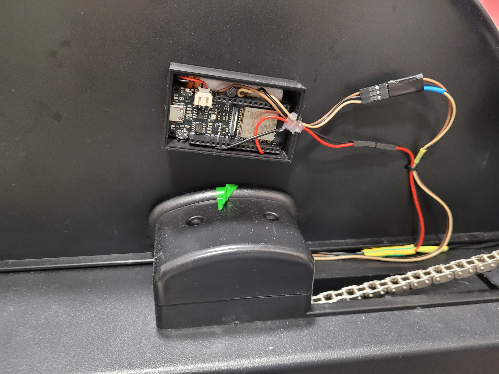
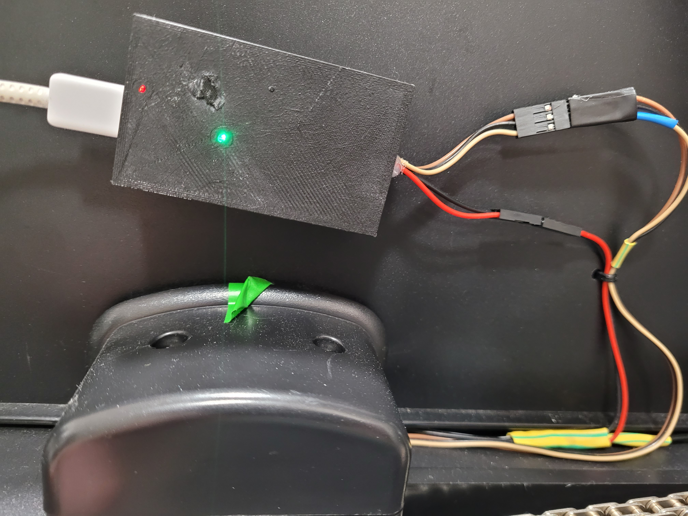
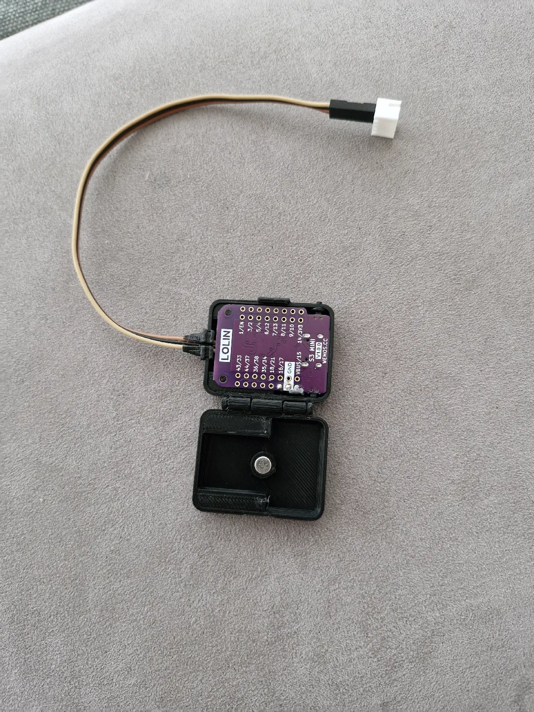
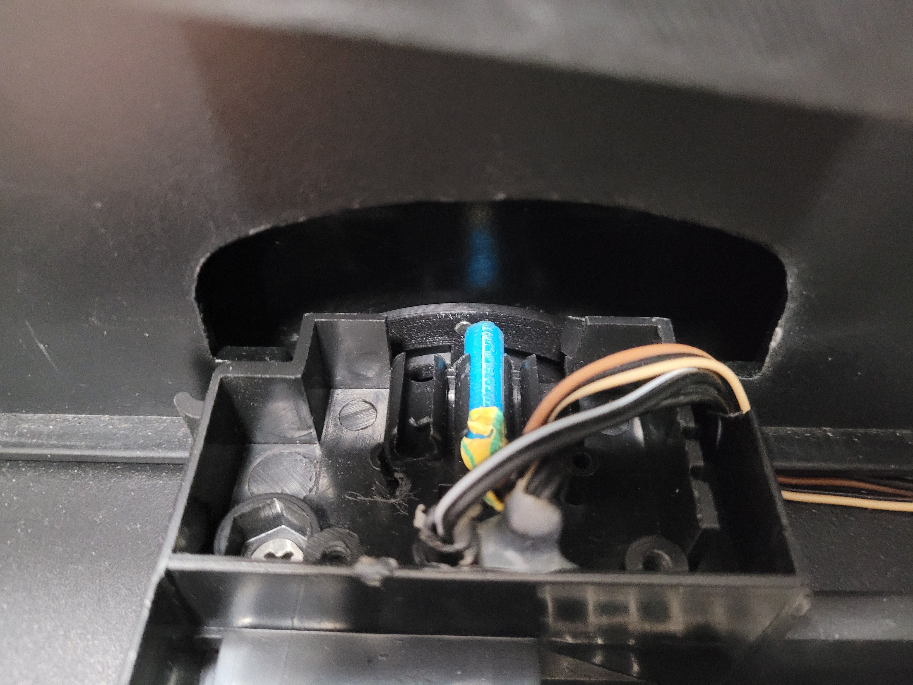

# Installation

There are multiple ways to install the code on the board.

For specifically supported bards one can use the precompiled firmware files (which is the simplest way) provided under the [Release page](https://github.com/Abasz/ESPRowingMonitor/releases) and flash them onto the board (e.g. via [ESPTools browser flasher](https://espressif.github.io/esptool-js/)). The easiest is to use the `dynamic rower profile` which supports runtime-configurable settings over BLE via the [WebGUI](https://abasz.github.io/ESPRowingMonitor-WebGUI/) but for pre calibrated rowers their specific firmware can be also used.

For custom boards one needs to compile the code into the firmware binary. This project uses PlatformIO. Firmware can be compiled with that either via CLI or VSCode extension.

For Linux systems an install script (`/bin/bash -c "$(curl -fsSL https://raw.githubusercontent.com/Abasz/ESPRowingMonitor/refs/heads/main/tools/install.sh)`") that downloads the code and dependencies and an interactive auto compiler script is provided. These guides the user through the installation and compilation process (please see more details [below](#auto-compiler)). For windows, Platformio (and or VSCode) needs to be installed manually. There are several tutorials on YouTube as well as on the [Platformio main page](https://platformio.org/).

If a board that is not specifically [supported](#other-already-supported-boards) is used as a first step the platformio.ini file needs the exact board name. There is a [list](https://docs.platformio.org/en/latest/boards/index.html#espressif-32) on the platformio website. It is recommended that a dual core ESP module is used for better performance (especially if the websocket will be used). Also setting (or deleting) the flash size may be necessary if not 4MB.

Once platformio.ini is set up, upload can be performed with the VSCode platformio extension or by running `platformio run -t upload` after connecting the board via USB.

## Auto compiler

For Linux users an [Auto Compiler](../tools/auto-compiler.sh) script is provided that can either compile for any combination of the supported boards and rowers or compile for any supported board and a custom rower settings file. For usage please see `./tools/auto-compiler.sh --help`

## Over-the-Air update

Please see dedicated page [OTA page](custom-ble-services.md)

## Circuit

Basically any ESP32 development board can be used, but this project was developed and tested on the [Firebeetle 2 Dev Board](https://www.dfrobot.com/product-2231.html) and [Lolin S3 Mini Board](https://www.wemos.cc/en/latest/s3/s3_mini.html).

As of version 5 a new more flexible board and other setting management schema is introduced that does not require keeping changes in separate branches. Basically board specific settings (like sensor pin, LED pin etc.) can be set in the `src/profiles`. Please see [Settings](../docs/settings.md) page for more details on how-tos.

The generic board profile should work with most ESP32 board (as it does not have any board specific code or feature). In this case the default sensor pin is `GPIO_NUM_26`, if this needs changing I recommend creating a new board profile so it does not get overwritten on updates. Also if battery level measurement is used the pin that is connected to the battery (potentially via a voltage divider) should be configured. The device goes to deep sleep if no peripheral is connected and the last impulse was was since `DEEP_SLEEP_TIMEOUT`. There before entering deepsleep mode the sensor pin is set as wakeup source (taking advantage of interrupt based wakeup) so the devices starts up on starting a session automatically.

### Other already supported boards

Currently there are two specific boards that are set up and supported:

1. Firebeetle 2
2. ESP32 Devkit 1.0
3. Lolin S3 mini

The FireBeetle 2 and board takes advantage of its internal connection between the battery and the ADC pin to measure battery level without additional circuitry and the RGB LED that changes color based on the measured battery level as well as uses features such as a digital switch (using a transistor) for the hall sensor power so battery consumption in deepsleep is minimal. To wake the device up a wakeup interrupt is set to a separate pin (on my machine this is connected to a reed switch on the handle chain sprocket). These settings can be enabled in the board profile (please refer to the [Settings](docs/settings.md) page).

Also for the the Firebeetle2 and Lolin S3 mini board I designed a 3D printable box:
[Firebeetle](https://www.printables.com/model/441912-firebeetle-2-esp32-e-box-for-esp-rowing-monitor).
[Lolin S3 mini print in place case](https://www.printables.com/model/1002665-wemos-lolin-s3-mini-case)

You can find some pictures of the setup below.

### Generic Air Rower

ESP Rowing Monitor was mainly tested and developed on a Generic Air Rower that is basically a [cheap Chinese clone](https://www.aliexpress.com/item/1005002302662579.html) of the Concept2.

The monitor provided with this rower was not very capable especially as it did not measure rotational impulses on the flywheel. So I designed a [magnet holder](https://www.printables.com/model/442340-generic-air-rower-flywheel-magnet-holder) that fits the flywheel and can hold up to 6 3x3 neodymium magnets (I use it with 3). Below are a few pictures.

### Further machines

Currently there are supported rower profiles for KayakFirst and [Old Danube Kayak](http://olddanube.com) Ergometers

1. Standard KayakFirst rower profile is for the old orange kayak first machine that I have fitted with a 3 magnet holder bracket
2. Newer, blue KayakFirst machine that has 6 magnet built in (the profile for the latter is still in development so slight changes will happen).
3. Old Danube profiles for machines built after 2024 using 2 or 6 magnets with either a lighter or heavier flywheel version.
