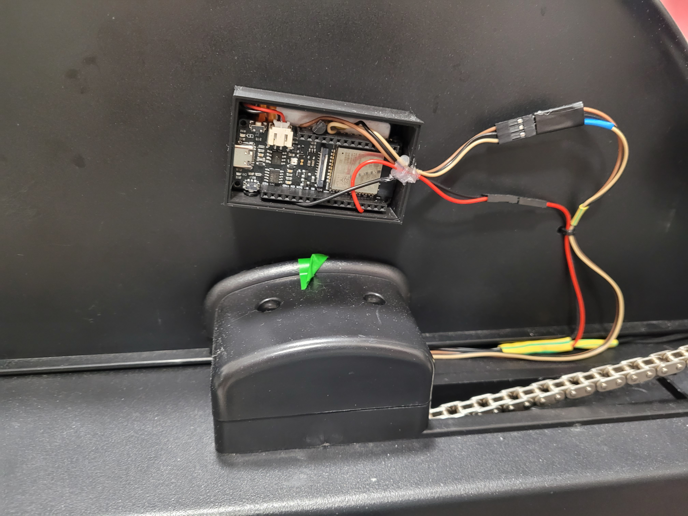
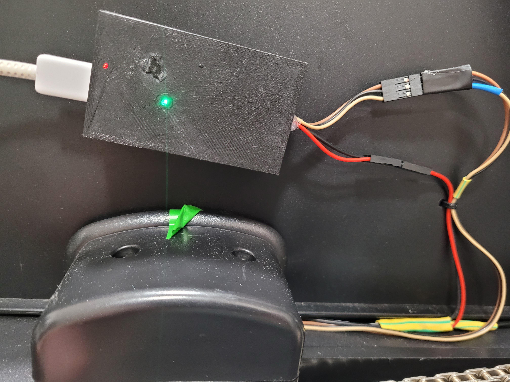
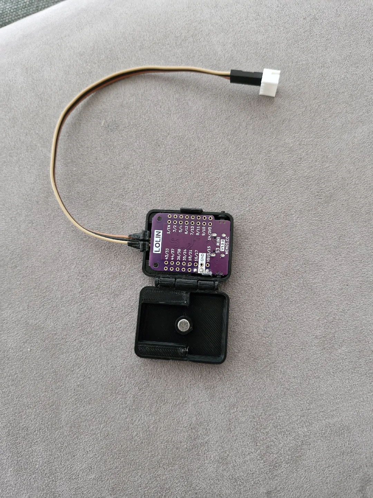
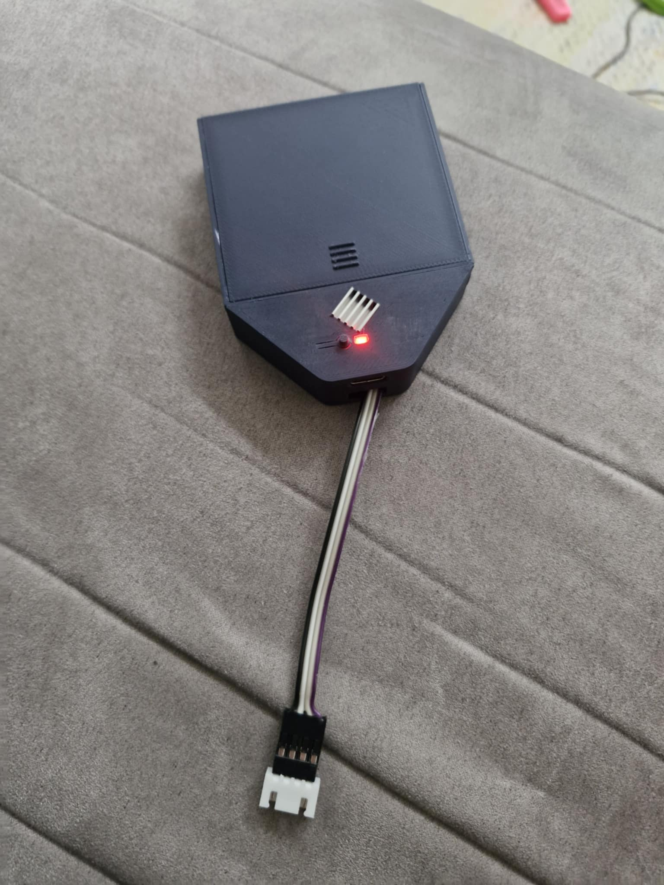
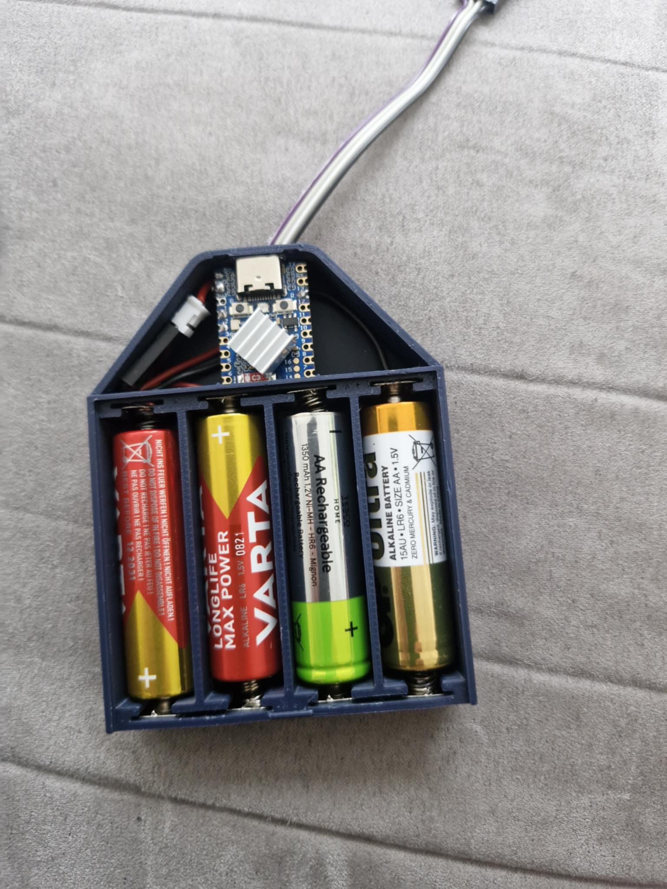
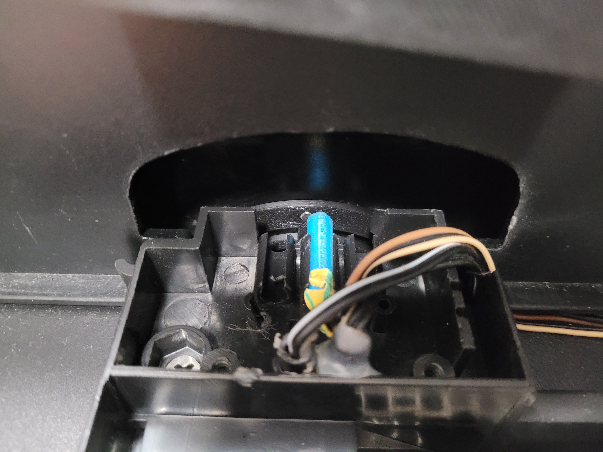
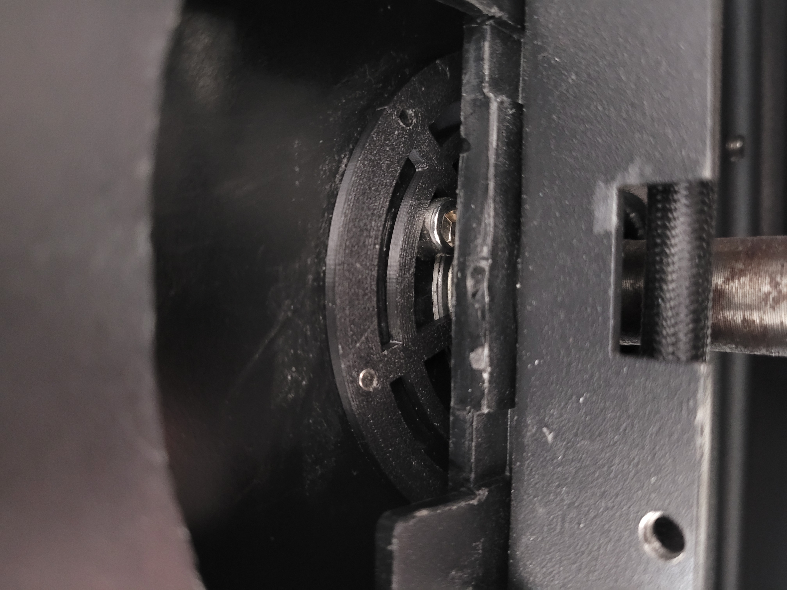

# Installation

There are multiple ways to install the code on the board. For common questions and troubleshooting, see the [FAQ](./faq.md).

For specifically supported boards, the simplest option is to use the precompiled firmware files provided on the [Releases page](https://github.com/Abasz/ESPRowingMonitor/releases) and flash them onto the board, for example via the [ESPTools browser flasher](https://espressif.github.io/esptool-js/). The easiest starting point is usually the `dynamic` rower profile, which supports runtime-configurable settings over BLE via the [WebGUI](https://abasz.github.io/ESPRowingMonitor-WebGUI/). For already calibrated rowers, dedicated profile-specific firmware can also be used. Firmware can also be flashed with the desktop GUI flasher provided for Windows, Linux, and macOS (see below).

For custom boards, the firmware needs to be compiled locally. ESP Rowing Monitor uses PlatformIO for firmware builds and CMake for host-side tests and calibration tooling.

For Linux systems, an install script (`/bin/bash -c "$(curl -fsSL https://raw.githubusercontent.com/Abasz/ESPRowingMonitor/refs/heads/main/tools/install.sh)"`) that downloads the code and dependencies and an interactive auto compiler script are provided. These guide the user through installation and compilation (see more details [below](#auto-compiler)). On Windows, PlatformIO and optionally VS Code need to be installed manually. There are several tutorials on YouTube as well as on the [PlatformIO main page](https://platformio.org/).

If a board that is not specifically [supported](#other-already-supported-boards) is used, the `platformio.ini` file needs the exact board name. There is a [list](https://docs.platformio.org/en/latest/boards/index.html#espressif-32) on the PlatformIO website. A dual-core ESP32 module is recommended for best performance, especially when using extended BLE metrics, OTA updates, or SD-card logging. Also setting or deleting the flash size may be necessary if it is not 4MB.

Once `platformio.ini` is set up, uploading can be performed with the VS Code PlatformIO extension or by running `platformio run -t upload` after connecting the board via USB.

## Auto compiler

For Linux users, an [Auto Compiler](../tools/auto-compiler.sh) script is provided that can either compile any combination of the supported boards and rowers or compile for any supported board and a custom rower settings file. For usage, see `./tools/auto-compiler.sh --help`.

## ESPTool Desktop GUI (firmware flasher)

A cross‑platform desktop GUI is available to flash firmware and manage precompiled firmware releases for the ESP Rowing Monitor without installing Python or CLI tools. The GUI allows selecting and flashing the supported Rowers and Boards based on the latest release.

- Download & flash precompiled firmware: the GUI can fetch the latest release and flash it based on the board attached via the USB while listing only boards automatically.
- Custom firmware support: the GUI also supports flashing local files from a local directory containing compiled .bin files and prepare the correct esptool write-flash command.
- Common tools: Read MAC, Chip ID, Erase Flash and other utilities are available.
- Auto-detect ports: the GUI auto-detects serial ports and can probe ports to determine the connected chip variant (ESP32, ESP32-S3, ESP8266, etc.).

- Windows: download the `esptool‑gui‑windows‑x64.exe` from the release assets and run it.
- Linux: download the `esptool‑gui‑linux‑x64` executable, mark it executable if needed (`chmod +x`), and run it.
- macOS: download the `esptool‑gui‑macos‑x64.tar.gz`, extract it, then open the `esptool‑gui.app`.

Notes:

- The GUI bundles `esptool` and `pyserial` and auto‑detects serial ports where supported.
- If you prefer a browser‑based option, you can still use the [ESPTools browser flasher](https://espressif.github.io/esptool-js/).
- If the executable does not work it is also possible to run the python script directly, but dependencies will need to be installed with `pip`.

## Over-the-Air update

Please see the dedicated [OTA page](./custom-ble-services.md#over-the-air-updater).

## Circuit

Basically any ESP32 development board can be used, but this project was developed and tested on the [FireBeetle 2 ESP32-E Dev Board](https://www.dfrobot.com/product-2231.html), [Lolin S3 Mini Board](https://www.wemos.cc/en/latest/s3/s3_mini.html) as well as on the [FireBeetle 2 ESP-S3 (N4)](https://www.dfrobot.com/product-2836.html) and [Waveshare ESP32-S3-Zero](https://www.waveshare.com/wiki/ESP32-S3-Zero) (as part of the OldDanube kayak ergometer development).

As of version 5, a more flexible board and rower settings scheme is used that does not require keeping changes in separate branches. Board-specific settings such as sensor pin, LED pin, wake-up pin, and battery ADC pin can be set in `src/profiles`. Please see the [Settings](./settings.md) page for more details.

The generic board profile should work with most ESP32 boards, as it does not contain board-specific code or features, but `platformio.ini` still needs the correct PlatformIO board name so the compiler loads the correct pin mappings and low-level features. In this case the default sensor pin is `GPIO_NUM_26`. If this needs changing, I recommend creating a dedicated board profile so it does not get overwritten on updates. If battery level measurement is used, the pin connected to the battery, potentially via a voltage divider, should also be configured. The device goes to deep sleep if no peripheral is connected and the last impulse was more than `DEEP_SLEEP_TIMEOUT` ago. Before entering deep sleep, the sensor pin is configured as a wakeup source so the device starts automatically when a new session begins.

### Other already supported boards

Currently there are 6 specific boards that are set up and supported:

1. FireBeetle 2 ESP32-E
2. FireBeetle 2 ESP32-S3 (N4)
3. ESP32 Devkit 1.0
4. Lolin S3 mini
5. Waveshare ESP32-S3 Zero
6. ESP32-S3 Super Mini

The FireBeetle 2 ESP32-E board takes advantage of its internal connection between the battery and the ADC pin to measure battery level without additional circuitry, and its RGB LED can be used to indicate the measured battery level. It also uses features such as a digital switch for the hall sensor power so battery consumption in deep sleep is minimal. To wake the device up, a separate wakeup interrupt can be configured, for example using a reed switch on the handle chain sprocket. These settings can be enabled in the board profile. Please refer to the [Settings](./settings.md) page.

Also for the the Firebeetle2 and Lolin S3 mini board I designed a 3D printable box:
[FireBeetle](https://www.printables.com/model/441912-firebeetle-2-esp32-e-box-for-esp-rowing-monitor).
[Lolin S3 mini print in place case](https://www.printables.com/model/1002665-wemos-lolin-s3-mini-case)

Also there is a comprehensive AA battery powered project for the [Waveshare ESP32-S3 Zero board](https://www.printables.com/model/1438697-waveshare-esp32-s3-zero-box-open).

You can find some pictures of the setup below.

### Generic Air Rower

ESP Rowing Monitor was mainly tested and developed on a Generic Air Rower that is basically a [cheap Chinese clone](https://www.aliexpress.com/item/1005002302662579.html) of the Concept2.

The monitor provided with this rower was not very capable especially as it did not measure rotational impulses on the flywheel. So I designed a [magnet holder](https://www.printables.com/model/442340-generic-air-rower-flywheel-magnet-holder) that fits the flywheel and can hold up to 6 3x3 neodymium magnets (I use it with 3). Below are a few pictures.

### Further machines

Currently there are supported rower profiles for KayakFirst and [Old Danube Kayak](http://olddanube.com) ergometers.

1. Standard KayakFirst rower profile is for the older orange KayakFirst machine fitted with a 3-magnet holder bracket.
2. Blue KayakFirst machine that has 6 magnets built in and is supported by a dedicated tuned profile.
3. Old Danube profiles for machines built in or after 2026 using 6 magnets.
