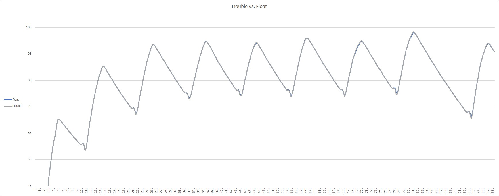

# Limitations

The ESP Rowing Monitor has several limitations that users should be aware of.

## CPU power and resource limitation of ESP32 chip

The ESP32 chip is available in a single core or dual core version with a clock speed of 240MHz. I recommend using the dual core (ESP32-S3 or wroom32) as the tests were done on dual core ESP32. Please note that the extended BLE metrics seem not to work on these chip version ESP32-D0WD-V3 (e.g. wemos d1 32, or dev kit v4).

Please note that the SD card write only works with the dual core version as the actual writing is offloaded to the second core.

The algorithm used for calculating the necessary data for stroke detection can become rather CPU hungry. In a nutshell, the issue is that the Theil-Sen Quadratic Regression is O(N&#178;), which means that as the size of the `IMPULSE_DATA_ARRAY_LENGTH` increases, the time required to complete the calculations increases exponentially (for more information, please see [this explanation](https://github.com/laberning/openrowingmonitor/blob/v1beta/docs/physics_openrowingmonitor.md#use-of-quadratic-theil-senn-regression-for-determining-%CE%B1-and-%CF%89-based-on-time-and-%CE%B8)).

I conducted some high-level tests and measured the execution times, which are shown in the table below for version 6:

|IMPULSE_DATA_ARRAY_LENGTH|Execution time (us)|
|:-----------------------:|:-----------------:|
|18                       |4628               |
|15                       |3308               |
|12                       |2393               |
|9                        |1636               |
|8                        |1425               |
|7                        |1222               |
|6                        |1062               |
|5                        |990                |
|3                        |748                |

The above table shows that with an `IMPULSE_DATA_ARRAY_LENGTH` size of 18, the total execution time of the calculations on every impulse is around 5ms if double precision is used. This could cause issues, for instance, when a new impulse comes in before the previous calculation is finished. Due to this, currently, the compiler does not allow an `IMPULSE_DATA_ARRAY_LENGTH` size higher than 15 (and double precision) and gives a warning at 14.

As an example, on my setup, I use 3 impulses per rotation. Based on my experience, the delta times cannot dip below 10ms. So with an `IMPULSE_DATA_ARRAY_LENGTH` size of 7 (execution time with double is approximately 1.2ms), this should be pretty much fine.

On other machine where 6 impulse per rotation happens, thanks to the more efficient algorithm, for an `IMPULSE_DATA_ARRAY_LENGTH` size of 12 with double precision can be used safely as the delta times should not dip below 2.3ms, giving sufficient buffer time for BLE updates to run.
_Note: on a dual core MCU frequent BLE related tasks are offloaded to the second core, and the ISR and the algorithm - along with small one-off and less frequent tasks - run on the main core, so strictly speaking these functions should not interfere on a dual core ESP32._

If, for some reason, testing shows that a higher value for the `IMPULSE_DATA_ARRAY_LENGTH` size is necessary, the execution time can be reduced to some extent if float precision is used instead of double. This is due to the fact that on the 32bit ESP32 MCU doubles are emulated hence, performance suffers:

|IMPULSE_DATA_ARRAY_LENGTH|Execution time (us)|
|:-----------------------:|:-----------------:|
|18                       |1854               |
|15                       |1469               |
|12                       |1206               |
|9                        |965               |
|8                        |908                |
|7                        |839                |
|6                        |780                |
|5                        |773                |
|3                        |618                |

Using float precision instead of double precision, of course, reduces the precision but shaves off the execution times significantly (notice the 4.6ms compared 1.8 for 18 data point). I have not run extensive testing on this, but for the limited simulations I run, this did not make a significant difference.

The below picture shows that the blue chart cuts some corners but generally follows the same curve (which does not mean that in certain edge cases the reduced precision does not create errors).

Generally the execution time under the new algorithm shows a second degree polynomial where time is dependent on the `IMPULSE_DATA_ARRAY_LENGTH` size:

Another limitation related to CPU speed is the refresh rate of the BLE peripherals. The refresh rate is intentionally limited to conserve resources. For example, the web server only updates on a new stroke or after a 4-second interval if no new stroke detected during this period.

In addition based on testing the ESP32s3 chip (e.g. on a Loling S3 mini board) is significantly more efficient than the wroom chips. Depending on the `IMPULSE_DATA_ARRAY_LENGTH` value the performance improvement is between 40-10% (performance improvement decreasing exponentially when increasing the value).

Based on this, this chip is now the clearly recommended chip for the purpose of this project.

## Noise filtering

Unlike ORM, the ESP Rowing Monitor has limited noise filtering capabilities on the ISR level. ESP Rowing Monitor implements only one impulse noise filter. This is based on the minimum required time between impulses. This means that the hardware used for sensing should produce clean impulses, and read switches with debounce may not yield accurate results. However, if the impulses per revolution are low (e.g. 1), and the minimum time between impulses can be set to a sufficiently high value, it may still work.

Please see [Sensor signal filter settings](settings.md#sensor-signal-filter-settings) for more details.

## BLE and connectivity

The ESP Rowing Monitor does not support heart rate monitors directly, but it is possible to add heart rate monitor capabilities through the WebGUI (with some limitations) using the browser BLE API.

The ESP Rowing Monitor is unlikely to support ANT+ protocol, as setting up the necessary hardware (ANT+ radio) has proven to be challenging and no success has been achieved in loading the ANT network processor firmware on tested chips.

The ESP Rowing Monitor exposes BLE Cycling Power Profile and Cycling Speed and Cadence Profile, which is a slight workaround. The wheel circumference should be set to 10mm in order for clients to show correct metrics (please see [this](settings.md) for more information). Note that in cases, such as with Garmin watches, the data from these profiles may only show up if the activity is set as cycling, and may not work with Garmin rowing activity profile. Manual activity type change may be needed for certain devices, such as Garmin FR255.
