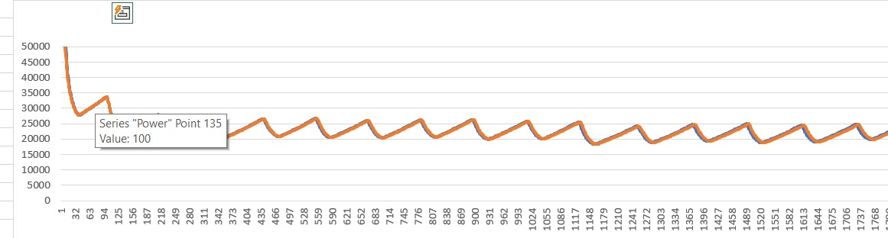
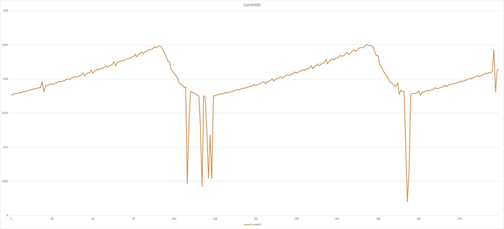
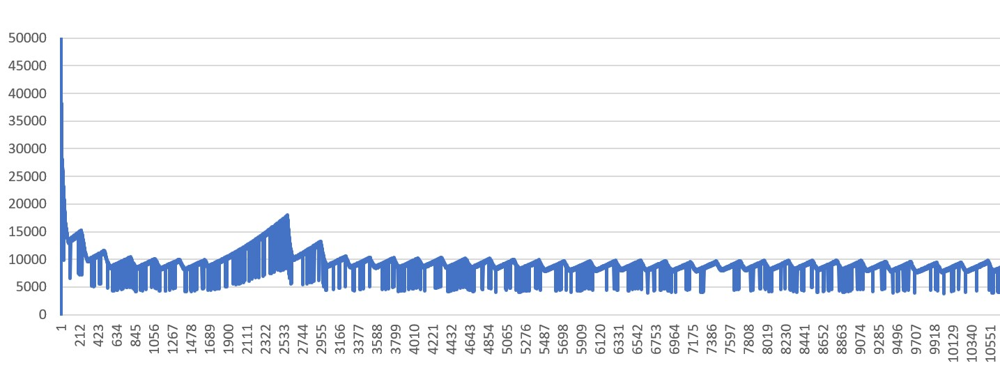

# Settings

There are several settings that need to be set and tuned in before ESP Rowing Monitor will properly detect strokes and calculate correct metrics.

Please note that ORM has a very good [wiki](https://github.com/laberning/openrowingmonitor/blob/v1beta/docs/rower_settings.md) on the settings it uses as well as some recommendations on tuning in the settings. Some settings used by ESP Rowing Monitor are the same or very similar. So in case of questions I recommend reading that page through as well.

Below is a list of all settings which can be set in `settings.h`.

## General settings

### DEFAULT_CPS_LOGGING_LEVEL

Sets the default logging level. Please note that if the log level was set by using opCode this will be overridden by the value that is saved to EEPROM.

```cpp
enum class ArduinoLogLevel : unsigned char
{
    LogLevelSilent = 0,
    LogLevelFatal = 1,
    LogLevelError = 2,
    LogLevelWarning = 3,
    LogLevelInfo = 4,
    LogLevelNotice = 4,
    LogLevelTrace = 5,
    LogLevelVerbose = 6
};
```

### DEFAULT_BLE_SERVICE

Sets the default BLE service profile. Please note that if BLE service flag was set by using opCode this will be overridden by the value that is saved to EEPROM.

```cpp
enum class BleServiceFlag : unsigned char
{
    CpsService,
    CscService
};
```

### ENABLE_WEBSOCKET_MONITOR

Enables or disables WebSocket monitor. For more details please refer to the [Wi-Fi](#wi-fi-and-websocket-monitor) section. Default is true.

### ENABLE_BLE_SERVICE

Enables or disables the BLE service to broadcast data. Default is true.

## Hardware settings

These settings relate to the hardware used by ESP32 and the rowing machine

### SENSOR_PIN_NUMBER

The pin number of the ESP32 to which the sensor is connected (typeof `gpio_num_t`).

### IMPULSES_PER_REVOLUTION

The number of impulses triggered by one full revolution of the flywheel. This is typically the number of magnets present on the flywheel.

### FLYWHEEL_INERTIA

The moment of inertia of the flywheel (in kg*m2). Please refer to the ORM [wiki](https://github.com/laberning/openrowingmonitor/blob/v1beta/docs/rower_settings.md#setting-the-flywheel-inertia) for more details.

### LED_BLINK_FREQUENCY

The time between blinks of the built in led of the ESP32 board if available

### SPROCKET_RADIUS

The sprocket that attaches the belt/chain to the flywheel (in centimeters) of the rowing machine.

Please see ORM [wiki](https://github.com/laberning/openrowingmonitor/blob/v1beta/docs/rower_settings.md#review-sprocketradius-and-minumumforcebeforestroke)

### CONCEPT_2_MAGIC_NUMBER

This is a constant that is commonly used to convert flywheel revolutions to a rowed distance and speed ([see the physics of ergometers](http://eodg.atm.ox.ac.uk/user/dudhia/rowing/physics/ergometer.html#section9)).

Please see ORM [wiki](https://github.com/laberning/openrowingmonitor/blob/v1beta/docs/rower_settings.md#settings-you-can-tweak) for further details.

## Sensor signal filter settings

These settings refer to the nose reduction of the reed/hall sensor signal. Please note that this is significantly simpler than the filtering that ORM does. Hence the use of a hall sensor is recommended, though I have tested this with reeds and issues generally only occur at a relatively slower rotation speed of the flywheel. There are several good resources on this topic. ORM has this [discussion](https://github.com/laberning/openrowingmonitor/discussions/121) and [this](https://github.com/laberning/openrowingmonitor/discussions/122) on the topic as well as a [youtube video](https://www.youtube.com/watch?v=7LimjYS04FQ&t=272s) on how reeds work.

### ROTATION_DEBOUNCE_TIME_MIN

The minimum time that should elapse between two impulses to be considered as valid impulse in milliseconds.

Generally for an air rower that produces 3 impulses per rotation, 7 should be fine, while for a Concept2, 5 is used.

### ROWING_STOPPED_THRESHOLD_PERIOD

The time to elapse after the last stroke for the monitor to consider the rower to be stopped. PM5 of the Concept2 uses 7 seconds.

## Drag factor filter settings

These settings control the drag factor calculation and provides different level of filter. From the purpose and inner workings of the drag factor, the ORM [wiki](https://github.com/laberning/openrowingmonitor/blob/v1beta/docs/rower_settings.md#dynamically-adapting-the-drag-factor) has an excellent summary.

### GOODNESS_OF_FIT_THRESHOLD

This settings determines the minimum level of quality needed for the recovery slope to be considered valid for the drag factor calculation. This setting is equivalent to ORM's [`minimumDragQuality`](https://github.com/laberning/openrowingmonitor/blob/v1beta/docs/rower_settings.md#dynamically-adapting-the-drag-factor).

### MAX_DRAG_FACTOR_RECOVERY_PERIOD

The time which if exceeded for the recovery period no drag factor is calculated. This should be generally less than `ROWING_STOPPED_THRESHOLD_PERIOD`

### LOWER_DRAG_FACTOR_THRESHOLD

The minimum drag factor value that should be considered valid. Below this value the drag factor will be discarded. For Concept2 this is around 75. For magnetic and water rower this is probably significantly higher.

### UPPER_DRAG_FACTOR_THRESHOLD

The maximum drag factor value that should be considered valid. Above this value the drag factor will be discarded. For Concept2 this is around 250. For magnetic and water rower this is probably significantly higher.

### DRAG_COEFFICIENTS_ARRAY_LENGTH

This is the length of the drag factor smoothing should it be required for consistent drag factor. Corresponds to ORM's `dragFactorSmoothing` setting.

## Stroke phase detection filter settings

These are the most important settings for getting the stroke detection correct. Once these are tuned in ESP Rowing Monitor will be able to detect stroke with a very high accuracy.

### IMPULSE_DATA_ARRAY_LENGTH

This setting determines how many consecutive impulses should be analyzed (used) for the stroke detection to consider a stroke to begin or end. The ORM [wiki]( https://github.com/laberning/openrowingmonitor/blob/v1beta/docs/rower_settings.md#setting-flanklength-and-minimumstrokequality) include more details I recommend reviewing it in detail (`flankLength`).

### FLOATING_POINT_PRECISION

This setting controls whether double or float precision should be used in the algorithm. This is important from a performance perspective, as using too many data points will increase loop execution time. Using 14 and a precision of double would require around 7ms to complete calculations. Hence impulses may be missed. For more detail please refer to the README's [Limitations](../README.md#limitations) section.

Generally, this setting is controlled by the compiler automatically based on the value of the `IMPULSE_DATA_ARRAY_LENGTH` (below 15 it is set to double, while 15 and above set to float) but may be overwritten by uncommenting it in `settings.h`. Please note that overwriting is ignored if `IMPULSE_DATA_ARRAY_LENGTH` is 15 or above.

### MINIMUM_POWERED_TORQUE

The minimum torque that should be present on the handle before ESP Rowing Monitor will consider moving to the drive phase of the stroke. Setting it to a higher positive value makes it more conservative (i.e. requires more torque before considering moving to the drive phase).

### MINIMUM_DRAG_TORQUE

The minimum torque that should be present on the handle before ESP Rowing Monitor will consider moving to the recovery phase of the stroke. If this is set to a positive ESP Rowing Monitor will trigger recovery phase quicker (potentially when there is still force to the handle). Setting it to a negative value will make the stroke detection algorithm more conservative (requiring a stronger counter drag force from the air/water/magnet). Only relevant if STROKE_DETECTION_TYPE is either BOTH or TORQUE

Please note: **MINIMUM_POWERED_TORQUE and MINIMUM_DRAG_TORQUE are the essence of the stroke detection algorithm for ESP Rowing Monitor. Depending on the amount of noise these settings may be critical, but for instance on air rowers both may be left as zero**

### STROKE_DETECTION_TYPE

By default ESP Rowing Monitor uses a torque based stroke detection algorithm with a slope of slope fall backup method. However, on certain machines that produces only a hand full impulses on the recovery phase this method may be hard to tune in consistently (due to the lack of useful data points). Therefore, the user can opt out this more advanced algorithm and fall back to the traditional (acceleration and deceleration based) stroke detection algorithm.

There are three options in this respect:

- _STROKE_DETECTION_TORQUE_: the more advanced torque based with the slope of slope as secondary algorithm (recommended for machines capable of producing several impulses per rotation),
- _STROKE_DETECTION_SLOPE_: the slope based (that is basically the traditional acceleration and deceleration base method), or
- _STROKE_DETECTION_BOTH_: use both at the same time

### MINIMUM_RECOVERY_SLOPE_MARGIN

This setting controls the fall back algorithm for detecting recovery. This value is basically the allowed absolute deviation that the slope of the recovery slopes within the last `IMPULSE_DATA_ARRAY_LENGTH` can be from a completely flat (i.e. zero) slope. Setting this to a very small number makes the algorithm conservative while higher values would require less flat slope (i.e. more likely to detect recovery). I recommend starting with a rather small value and if there are missed strokes starting incremental increase while looking at the handle force values to see whether torque detection for the drive works correctly. If for instance recovery is not detected because the torque never goes below a certain value it may be better to set _MINIMUM_DRAG_TORQUE_ instead of increasing this setting. Based on my experience on air rower (with limited noise I might add) this is useful if the damper is set on the fly as it creates certain undesired issues that throws off torque based detection. So the fall back is needed to compensate for the stroke which had the damper setting movement. After which it all goes back to the normal track.

Only relevant if STROKE_DETECTION_TYPE is either BOTH or TORQUE

### MINIMUM_RECOVERY_SLOPE

This is the minimum recovery slope. This setting corresponds to the [minimumRecoverySlope](https://github.com/JaapvanEkris/openrowingmonitor/blob/v1beta_updates/docs/rower_settings.md#setting-flanklength-and-minimumstrokequality) settings in ORM with the difference that there is no check for the slope quality. Setting this to 0 would mean that a stroke is detected as soon as the slope of the flanks becomes positive (i.e. flywheel is decelerating).

Only relevant if STROKE_DETECTION_TYPE is either BOTH or SLOPE

### STROKE_DEBOUNCE_TIME

This is the minimum time that is required to stay in a phase of the cycle (drive or recovery) if change would be triggered within this period it is ignored. This should generally mean that this is the minimum time between strokes. This setting corresponds to ORM's `minimumDriveTime` and `minimumRecoveryTime` (please see [here](https://github.com/laberning/openrowingmonitor/blob/v1beta/docs/rower_settings.md#minimumdrivetime-and-minimumrecoverytime)) but having only one setting for both.

## Network settings

These settings are required for the websocket to work

### PORT

The port number that should be used by ESP32 MCU when creating the websocket server

### Wi-Fi and WebSocket monitor

The Wi-Fi credentials are set up in a way that it cannot be accidentally committed to GitHub. Hence it should be set in a separate file named `wifi-config.ini` as follows:

```ini
[env:esp32]
build_flags = 
 -O2
 -std=c++2a
 -std=gnu++2a
    '-D LOCAL_SSID=My SSID'
    '-D PASSPHRASE=MySecretPWD'
```

File name is critical as that is the name that platformio.ini includes when compiling. Please note if no wifi-config.ini is provided (or the `LOCAL_SSID` and/or `PASSPHRASE` is not provided as a macro variable) WebSocket monitor will be disabled by the compiler.

## Device power management settings

These settings are less critical (basically optional), it is used for measuring and calculating the battery level via the ADC of the ESP32. There are boards that have internal battery charging capabilities (e.g. Firebeetle that I use but many wemos based dev boards have this too). It is also possible to use external ADC capable pin on the MCU.

### BATTERY_PIN_NUMBER

The GPIO Pin on which the battery level can be measured.

### VOLTAGE_DIVIDER_RATIO

If the maximum battery voltage is higher than 3.3v (that is the maximum voltage for the pins on the ESP32) voltage divider is required to use the ADC. This sets the ratio of the voltage divider.

### BATTERY_VOLTAGE_MIN_and_BATTERY_VOLTAGE_MAX

At what voltage should the battery be considered full or empty. For example 3.7v LIPO batteries are considered full at 4.2v and empty at 3.3v.

### BATTERY_LEVEL_ARRAY_LENGTH

Number of measurements to use for smoothing.

### INITIAL_BATTERY_LEVEL_MEASUREMENT_COUNT

How many measurements should be made at startup to have an accurate figure. The higher this value, the longer the startup takes.

### BATTERY_MEASUREMENT_FREQUENCY

How often should the monitor measure the battery level

### DEEP_SLEEP_TIMEOUT

After how long of inactivity the device should go into deep sleep to conserve battery power.

## Calibration

### Flywheel inertia

In order for ESP Rowing Monitor to calculate accurate metrics it needs the moment of inertia of the flywheel. This can be measured based on the following [guide](https://pressbooks.online.ucf.edu/osuniversityphysics/chapter/10-5-calculating-moments-of-inertia/). This may seem complicated, but essentially it is possible to account for each piece of element in the flywheel and add their contribution. This has been done in the open [ergware project](https://dvernooy.github.io/projects/ergware/). Note this requires disassembly of the machine and the flywheel so that the individual parts can be measured.

In [one of the discussions](https://github.com/laberning/openrowingmonitor/discussions/113) under ORM another method has been reported that can be used for calculating the inertia of the flywheel, but I have not tried it myself.

Please note that if the moment of inertia cannot be measured, than I recommend a trial and error approach, where setting it to some figure and see if it spits out sensible data. Actually, if one does not compare the performance measured on different machines than the important part is consistency in the results. Alternative approach is to go and measure an interval session on a Concept 2 and than do the same on the machine that is being calibrated and tweak the inertia so they both show similar results. I recommend using heart rate to see if both machines show the same effort.

### Stroke detection

In order to calibrate the settings, the most important are those that necessary for the stroke detection I recommend the following steps:

1. Set logging to verbose so both the calculated delta times and the raw unfiltered impulse data is logged
2. Use the `IMPULSE_DATA_ARRAY_LENGTH` parameter to set the number of impulses produced for 2-3 rotations but not more than 12 (e.g. for Concept2 12 is proven to work quite well). If you have only one impulse per rotation, start with 4 or 5.
3. Set up the Serial monitor and save the output to a file
4. Do 10-20 strokes with steady stroke rate
5. See how many strokes ESP Rowing Monitor recognized

If it is way off I recommend first plotting a chart in excel (or in similar program) based on the delta times logged to see how much noise is there. The below pictures shows some examples:

Clean delta times:



Usable delta times with some noise:



Too noisy and needs hardware tweaking and potentially additional cleanup:



Actually, the above chart shows that the reed/hall sensor bounces (this is more of an issue with reeds). One my get away with increasing the `ROTATION_DEBOUNCE_TIME_MIN` but possibly better sensor placement should be reviewed as well. There are several discussions on noise reduction under the ORM repo. I recommend starting [here](https://github.com/laberning/openrowingmonitor/discussions/122).

Once the input data is sufficiently cleaned up it is possible to replay a previous session on a PC with the e2e test. To do this one needs to include the delta times in a text file (every delta time, but just the time should be on a separate line). See example [here](examples/steady).

### Running a simulation

In order to run the simulation, the e2e test needs to be compiled. There is a makefile to ease the compilation that needs to be run with the e2e flag (`make e2e`). The executable will be under `build/run_e2e_test.out`. This file should receive the file path that contains the delta times as parameter.

So basically, change one setting at a time, note whether the stroke detection improves and then tweak the settings until stroke detection is consistent i.e. the reported number of strokes matches the number of strokes done.

Please note that after changing a setting the executable needs recompiling (i.e. running `make e2e`).
