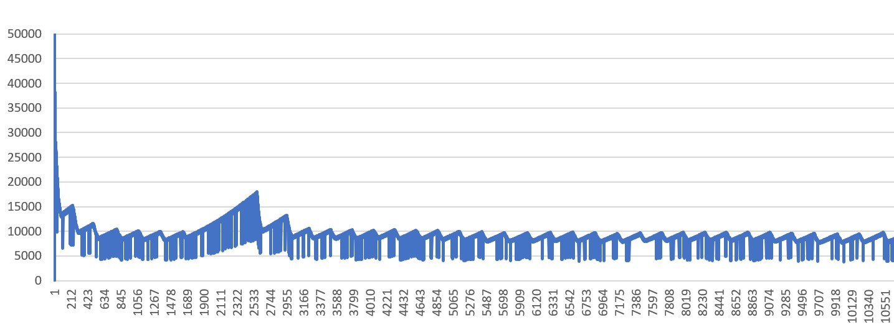
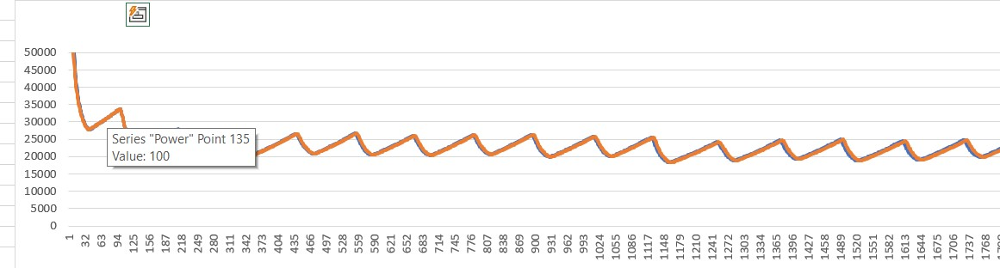
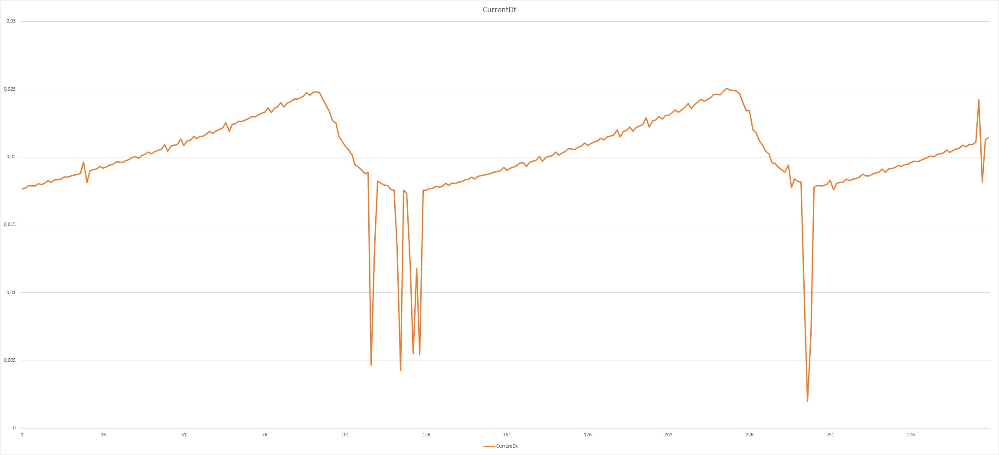

# Settings

There are several settings that need to be set and tuned in before ESP Rowing Monitor will properly detect strokes and calculate correct metrics. For a comprehensive calibration guide and troubleshooting tips, see the [FAQ](./faq.md).

Please note that ORM has a very good [wiki](https://github.com/laberning/openrowingmonitor/blob/v1beta/docs/rower_settings.md) on the settings it uses as well as some recommendations on tuning in the settings. Some settings used by ESP Rowing Monitor are the same or very similar. So in case of questions I recommend reading that page through as well.

As of version 5 the project is able to handle different board and rower settings (similarly to ORM) which provides flexibility and generally enables easier distribution of settings.

Basically the board and rower settings can be loaded by compiling the appropriate PlatformIO environment (for specifically supported boards and rowers) or by creating a `custom.settings.h` file and compile the project with the platformio environment of `custom` (so upon compilation the custom.settings.h file is used). This ensures that the selected board and machine settings are loaded. Please note that with custom settings file as a first step the platformio.ini file needs the exact board name under the [generic-board] section like this `board = dfrobot_firebeetle2_esp32s3`.

Alternatively for Linux systems an [Auto Compiler](./installation.md#auto-compiler) script is provided that interactively helps with compilation (including installation of necessary dependencies).

Example of a custom settings file is shown in the default.settings.h file (which I do not recommend to change as it gets overwritten on updates).

Below is a list of all settings which can be set, there are 3 categories

## General settings

###

#### DEFAULT_CPS_LOGGING_LEVEL

Sets the default logging level. Please note that if the log level was set by using opCode this will be overridden by the value that is saved to EEPROM.

```cpp
enum class ArduinoLogLevel : unsigned char
{
    LogLevelSilent = 0,
    LogLevelFatal = 1,
    LogLevelError = 2,
    LogLevelWarning = 3,
    LogLevelInfo = 4,
    LogLevelNotice = 4,
    LogLevelTrace = 5,
    LogLevelVerbose = 6
};
```

#### DEFAULT_BLE_SERVICE

Sets the default BLE service profile. Please note that if BLE service flag was set by using opCode this will be overridden by the value that is saved to EEPROM.

```cpp
enum class BleServiceFlag : unsigned char
{
    CpsService,
    CscService
};
```

#### HAS_BLE_EXTENDED_METRICS

Enables or disables the extended BLE API to broadcast data. Default is true.

#### ENABLE_BLUETOOTH_DELTA_TIME_LOGGING

Enables or disables to delta time logging via BLE (by setting up a specific characteristic under extended metrics service). This serves debugging and calibration purposes (without a PC and serial connection) as it allows the recording the delta times between impulses measured that can be replayed as a [simulation](#running-a-simulation) later on. Default is false.

#### SUPPORT_SD_CARD_LOGGING

This settings enables logging deltaTime values to a connected SD Card.

#### ENABLE_RUNTIME_SETTINGS

Enables changing certain settings at runtime (without recompilation) via the Settings Service BLE endpoint which is then saved to flash on the device (currently support Flywheel inertia and Magic Constant). Note allowing dynamic settings change may have some immaterial performance hit (please see [Limitations](./limitation.md)).

Default: false

#### ENABLE_DEBOUNCE_FILTER

Enables debounce filter for incoming rotation/sensor impulses. This setting aims at reducing false impulses caused by noisy sensors (for example mechanical reed switches) by rejecting impulses that are highly inconsistent with the previous measured interval (if the absolute difference of current and previous delta times is greater than the current delta time).

Typical bounce on reed looks something like this:


Enabling this filter is recommended only if you're using a mechanical/reed sensor that occasionally produces spurious pulses or when you observe large, single-sample delta drops in recorded impulse data. For Hall-effect sensors (which due to built in hysteresis are less prone to such issue) the filter is generally not required. For more information on reed bounce please see [this video](https://www.youtube.com/watch?v=7LimjYS04FQ&t=278s) and [FAQ Entry #5](./faq.md#5-reed-switches-bounce--can-i-reduce-bounce-reliably) for community-proven techniques to reduce bounce.

Default: false

## Board profile settings

These settings relate to the hardware used by ESP32 and the rowing machine. This can be added to a `your-board.board-profile.h` file.

### General board settings

#### BAUD_RATE

The baud rate for the UART serial connection. Any of value from the `BaudRates` enum can be set, I recommend using as high as possible to get the best performance. On the Firebeetle and Devkit v1.0 board, I am able to use a baud rate of 1 500 000. Generic board profile uses 115 200.

#### BLE_SIGNAL_STRENGTH

It is possible to set the TX power of the BLE. The higher the TX power the longer the BLE range of the ESP32 is but consumes more power, currently 3 levels are supported:

1. PowerSaver (setting it to the lowest)
2. Default (corresponds to N0dBm)
3. MaxPower (setting it to the highest)

#### LED_PIN

If a LED is added and its not on the default LED pin, the board default pin can be overwritten. If not provided `LED_BUILTIN` is used if available, if not LED related features are disabled.

#### LED_BLINK_FREQUENCY

If LED related features are enabled, this sets the blinking frequency in case of no connected peripheral (if peripheral is connected LED will remain on until).

#### IS_RGB

It is possible to indicate battery charge via a connected RGB LED (actually some boards such as the FireBeetle 2 supports this by default via on-board RGB LED). Setting this to `true` enables these RGB related features. Default is false.

#### RGB_LED_COLOR_CHANNEL_ORDER

This is the `EOrder` enum that allows setting the color channel order as some RGB LEDs use GBR instead of RGB order (e.g. Firebeetle2 devboard). Default is `EOrder::RGB`.

#### SD_CARD_CHIP_SELECT_PIN

The pin number of the ESP32 to which the SD Card chip select is connected (typeof `gpio_num_t`). Rest of the SD Card pins should be connected to the SPI pins of the board.

#### SENSOR_PIN_NUMBER

The pin number of the ESP32 to which the sensor is connected (typeof `gpio_num_t`). For guidance on choosing between Hall effect sensors and reed switches, see [FAQ Entry #3](./faq.md#3-should-i-use-a-hall-sensor-or-a-reed-switch) and [FAQ Entry #6](./faq.md#6-which-hall-sensor-modules-are-known-to-work) for known working sensor modules.

#### SENSOR_ON_SWITCH_PIN_NUMBER

Hall sensors consume a relatively significant amount of power (around 3mA in general). So for battery operated sensors, it is more efficient to switch off the hall sensor while in deepsleep (e.g. using a transistor). This settings allows selecting a pin for this purpose. If no sensor on switch is provided this should be set to `GPIO_NUM_NC` (i.e. not connected) that disables the related features.

#### WAKEUP_SENSOR_PIN_NUMBER

In case where the signal pin is disabled (e.g. because the hall sensor is switched off) the auto wake up interrupt feature of the device (i.e. when it detects a signal start the monitor automatically) cannot work. So this settings enable an alternative wake up pin to wake the monitor up from deep sleep mode. On my machine I have a reed sensor on the handle that gets triggered when the handle is pulled and that wakes up the monitor so the hall sensor can be off and save battery while in deep sleep. If this pin is not used set it to `GPIO_NUM_NC` (which is also default). This disables the related features as well. For detailed wiring guidance, see [FAQ Entry #12](./faq.md#12-how-do-i-wire-the-wakeup-sensor-for-battery-powered-setups).

### Device power management settings

These settings are less critical (basically optional), it is used for measuring and calculating the battery level via the ADC of the ESP32. There are boards that have internal battery charging capabilities (e.g. Firebeetle that I use but many wemos based dev boards have this too). It is also possible to use external ADC capable pin on the MCU.

#### BATTERY_PIN_NUMBER

The GPIO Pin on which the battery level can be measured. If no battery pin is available use `GPIO_NUM_NC`.

#### VOLTAGE_DIVIDER_RATIO

If the maximum battery voltage is higher than 3.3v (that is the maximum voltage for the pins on the ESP32) voltage divider is required to use the ADC. This sets the ratio of the voltage divider.

#### BATTERY_VOLTAGE_MIN_and_BATTERY_VOLTAGE_MAX

At what voltage should the battery be considered full or empty. For example 3.7v LIPO batteries are considered full at 4.2v and empty at 3.3v.

#### BATTERY_LEVEL_ARRAY_LENGTH

Number of measurements to use for smoothing.

#### INITIAL_BATTERY_LEVEL_MEASUREMENT_COUNT

How many measurements should be made at startup to have an accurate figure. The higher this value, the longer the startup takes.

#### BATTERY_MEASUREMENT_FREQUENCY

How often should the monitor measure the battery level

#### DEEP_SLEEP_TIMEOUT

After how long of inactivity the device should go into deep sleep to conserve battery power.

## Rower profile settings

These are the settings applicable to the rowing machine. It can be included in a `your-rower.rower-profile.h`

### General rower settings

#### DEVICE_NAME

This is the device name that is set as BLE Device name. This should be without quotes and should not exceed 18 characters or if `ADD_BLE_SERVICE_TO_DEVICE_NAME` is true 11 characters.

#### ADD_BLE_SERVICE_TO_DEVICE_NAME

Enables or disables the BLE service flag to be included in the BLE device name (like `(CPS)`, `(FTMS)`, etc.) with a space separator. Default is true.

#### MODEL_NUMBER

This is the model number for the BLE device profile service. This should be one word without spaces and without quotes.

#### HARDWARE_REVISION

Optional hardware revision string that will be exposed through the BLE Device Information Service (Hardware Revision String characteristic). If defined at compile time using the `HARDWARE_REVISION` macro that value is used. If not provided the project will try to infer a name from `ROWER_PROFILE` (for example `profiles/lolinS3-mini.rower-profile.h` → `lolinS3-mini`) and finally falls back to `Custom` when neither is set.

#### SERIAL_NUMBER

Serial number for the BLE device profile. This can be anything but should be within quotes. Default is the last 3 bytes of the MAC Address formatted to HEX without the 0x (i.e. 6 characters).

#### ADD_SERIAL_IN_DEVICE_NAME

Include the Serial Number in the BLE device name with an additional `-` separator from the device name. Please note that the total device name length cannot be longer than 18 characters. Default is false.

#### MIN_BLE_UPDATE_INTERVAL

The minimum time interval (in milliseconds) between BLE data updates when no new stroke has been detected. This setting controls how frequently the data to be sent to the connected BLE clients (e.g., Garmin watches, WebGUI) should be updated with fresh distance and other metrics when the rower is active but hasn't completed a new stroke.

This value must be at least 1,000 millisecond.

Please note setting this to too low would create ripples in the speed data, while setting this to too high would increase the distance mismatch in Garmin watches due to their interpolation behaviour (please see [issue #25](https://github.com/Abasz/ESPRowingMonitor/issues/25) for further details).

Default: 4000 (4 seconds)

### Machine settings

#### IMPULSES_PER_REVOLUTION

The number of impulses triggered by one full revolution of the flywheel. This is typically the number of magnets present on the flywheel. For guidance on how many magnets to use and placement considerations, see [FAQ Entry #7](./faq.md#7-how-many-magnets-should-i-use-and-where-should-they-be-placed).

#### FLYWHEEL_INERTIA

The moment of inertia of the flywheel (in kg\*m²). This is a critical parameter that directly affects calculated power, distance, and drag factor. For comprehensive measurement methods including swing period, CAD modeling, component-by-component calculation, estimation from similar machines, and iterative tuning, see [FAQ Entry #10](./faq.md#10-how-do-i-measure-flywheel-inertia).

#### SPROCKET_RADIUS

The sprocket that attaches the belt/chain to the flywheel (in centimeters) of the rowing machine. Measure the effective radius at the point where the chain/belt contacts the pulley, not the outer edge. For detailed measurement guidance, see [FAQ Entry #8](./faq.md#8-where-to-measure-sprocket-radius-and-why-it-matters).

Please see ORM [wiki](https://github.com/laberning/openrowingmonitor/blob/v1beta/docs/rower_settings.md#review-sprocketradius-and-minumumforcebeforestroke)

#### CONCEPT_2_MAGIC_NUMBER

This is a constant that is commonly used to convert flywheel revolutions to a rowed distance and speed ([see the physics of ergometers](http://eodg.atm.ox.ac.uk/user/dudhia/rowing/physics/ergometer.html#section9)).

Please see ORM [wiki](https://github.com/laberning/openrowingmonitor/blob/v1beta/docs/rower_settings.md#settings-you-can-tweak) for further details.

### Sensor signal filter settings

These settings refer to the noise reduction of the reed/hall sensor signal. Please note that this is significantly simpler than the filtering that ORM does. Hence the use of a hall sensor is recommended (see [FAQ Entry #3](./faq.md#3-should-i-use-a-hall-sensor-or-a-reed-switch) for Hall vs Reed comparison and [FAQ Entry #6](./faq.md#6-which-hall-sensor-modules-are-known-to-work) for known working modules), though I have tested this with reeds and issues generally only occur at a relatively slower rotation speed of the flywheel. For reed bounce reduction techniques, see [FAQ Entry #5](./faq.md#5-reed-switches-bounce--can-i-reduce-bounce-reliably). There are several good resources on this topic. ORM has this [discussion](https://github.com/laberning/openrowingmonitor/discussions/121) and [this](https://github.com/laberning/openrowingmonitor/discussions/122) on the topic as well as a [youtube video](https://www.youtube.com/watch?v=7LimjYS04FQ&t=272s) on how reeds work.

#### ROTATION_DEBOUNCE_TIME_MIN

The minimum time that should elapse between two impulses to be considered as valid impulse in milliseconds.

Generally for an air rower that produces 3 impulses per rotation, 7 should be fine, while for a Concept2, 5 is used.

#### ROWING_STOPPED_THRESHOLD_PERIOD

The time to elapse after the last stroke for the monitor to consider the rower to be stopped. PM5 of the Concept2 uses 7 seconds.

### Drag factor filter settings

These settings control the drag factor calculation and provides different level of filter. From the purpose and inner workings of the drag factor, the ORM [wiki](https://github.com/laberning/openrowingmonitor/blob/v1beta/docs/rower_settings.md#dynamically-adapting-the-drag-factor) has an excellent summary.

#### GOODNESS_OF_FIT_THRESHOLD

This settings determines the minimum level of quality needed for the recovery slope to be considered valid for the drag factor calculation. This setting is equivalent to ORM's [`minimumDragQuality`](https://github.com/laberning/openrowingmonitor/blob/v1beta/docs/rower_settings.md#dynamically-adapting-the-drag-factor). Note: Water rowers and magnetic rowers may need lower values (0.6-0.8) due to their resistance characteristics — see [FAQ Entry #10](./faq.md#10-how-do-i-measure-flywheel-inertia) for water rower specific considerations.

#### MAX_DRAG_FACTOR_RECOVERY_PERIOD

The time which if exceeded for the recovery period no drag factor is calculated. This should be generally less than `ROWING_STOPPED_THRESHOLD_PERIOD`

#### LOWER_DRAG_FACTOR_THRESHOLD

The minimum drag factor value that should be considered valid. Below this value the drag factor will be discarded. For Concept2 this is around 75. For magnetic and water rower this is probably significantly higher.

#### UPPER_DRAG_FACTOR_THRESHOLD

The maximum drag factor value that should be considered valid. Above this value the drag factor will be discarded. For Concept2 this is around 250. For magnetic and water rower this is probably significantly higher.

#### DRAG_COEFFICIENTS_ARRAY_LENGTH

This is the length of the drag factor smoothing should it be required for consistent drag factor. Corresponds to ORM's `dragFactorSmoothing` setting.

### Stroke phase detection filter settings

These are the most important settings for getting the stroke detection correct. Once these are tuned in ESP Rowing Monitor will be able to detect stroke with a very high accuracy.

#### IMPULSE_DATA_ARRAY_LENGTH

This setting determines how many consecutive impulses should be analyzed (used) for the stroke detection to consider a stroke to begin or end. Typically set to 1.5-2× your magnet count (e.g., 6-7 for 4 magnets). Setting this too high can lead to skipped strokes while too low can result in ghost strokes. The ORM [wiki](https://github.com/laberning/openrowingmonitor/blob/v1beta/docs/rower_settings.md#setting-flanklength-and-minimumstrokequality) includes more details I recommend reviewing it in detail (`flankLength`). For comprehensive calibration guidance, see [FAQ Entry #9](./faq.md#9-how-do-i-calibrate-esp-rowing-monitor).

#### FLOATING_POINT_PRECISION

This setting controls whether double or float precision should be used in the algorithm. This is important from a performance perspective, as using too many data points will increase loop execution time. Using 14 and a precision of double would require around 4ms to complete calculations. Hence impulses may be missed if they come in quicker than 4ms. For more detail please refer to the README's [Limitations](../README.md#limitations) section.

Generally, this setting is controlled by the compiler automatically based on the value of the `IMPULSE_DATA_ARRAY_LENGTH` (below 15 it is set to double, while 15 and above set to float) but may be overwritten by uncommenting/adding `#define FLOATING_POINT_PRECISION PRECISION_DOUBLE)` in the rower profile file. Please note that overwriting is ignored if `IMPULSE_DATA_ARRAY_LENGTH` is 15 or above.

#### MINIMUM_POWERED_TORQUE

The minimum torque that should be present on the handle before ESP Rowing Monitor will consider moving to the drive phase of the stroke. Setting it to a higher positive value makes it more conservative (i.e. requires more torque before considering moving to the drive phase).

#### MINIMUM_DRAG_TORQUE

The minimum torque that should be present on the handle before ESP Rowing Monitor will consider moving to the recovery phase of the stroke. If this is set to a positive ESP Rowing Monitor will trigger recovery phase quicker (potentially when there is still force to the handle). Setting it to a negative value will make the stroke detection algorithm more conservative (requiring a stronger counter drag force from the air/water/magnet). Only relevant if STROKE_DETECTION_TYPE is either BOTH or TORQUE

Please note: **MINIMUM_POWERED_TORQUE and MINIMUM_DRAG_TORQUE are the essence of the stroke detection algorithm for ESP Rowing Monitor. Depending on the amount of noise these settings may be critical, but for instance on air rowers both may be left as zero**

#### STROKE_DETECTION_TYPE

By default ESP Rowing Monitor uses a torque based stroke detection algorithm with a slope of slope fall backup method. However, on certain machines that produces only a hand full impulses on the recovery phase this method may be hard to tune in consistently (due to the lack of useful data points). Therefore, the user can opt out this more advanced algorithm and fall back to the traditional (acceleration and deceleration based) stroke detection algorithm.

There are three options in this respect:

- _STROKE_DETECTION_TORQUE_: the more advanced torque based with the slope of slope as secondary algorithm (recommended for machines capable of producing several impulses per rotation),
- _STROKE_DETECTION_SLOPE_: the slope based (that is basically the traditional acceleration and deceleration base method), or
- _STROKE_DETECTION_BOTH_: use both at the same time

#### MINIMUM_RECOVERY_SLOPE

This is the minimum recovery slope. This setting corresponds to the [minimumRecoverySlope](https://github.com/JaapvanEkris/openrowingmonitor/blob/v1beta_updates/docs/rower_settings.md#setting-flanklength-and-minimumstrokequality) settings in ORM with the difference that there is no check for the slope quality. Setting this to 0 would mean that a stroke is detected as soon as the slope of the flanks becomes positive (i.e. flywheel is decelerating).

Only relevant if STROKE_DETECTION_TYPE is either BOTH or SLOPE

#### MINIMUM_RECOVERY_TIME

This is the minimum time that is required to stay in the recovery phase, if change would be triggered within this period it is ignored. This should generally mean that this is the minimum time before drive phase can start within the stroke. This setting corresponds to ORM's `minimumRecoveryTime` (please see [ORM rower settings documentation](https://github.com/JaapvanEkris/openrowingmonitor/tree/main/docs/rower_settings.md#minimumdrivetime-and-minimumrecoverytime)).

#### MINIMUM_DRIVE_TIME

This is the minimum time that is required to stay in the drive phase, if change would be triggered within this period it is ignored. This should generally mean that this is the minimum time before recovery phase can start within the strokes. This setting corresponds to ORM's `minimumDriveTime` (please see [ORM rower settings documentation](https://github.com/JaapvanEkris/openrowingmonitor/tree/main/docs/rower_settings.md#minimumdrivetime-and-minimumrecoverytime)).

#### DRIVE_HANDLE_FORCES_MAX_CAPACITY

This is the maximum number of datapoint that can occur within one drive phase (unsigned char). If the number of impulses exceed this number within the drive phase a recovery is force triggered. The purpose of this setting is two folded: 1. it avoids that due to missed strokes a memory leak occurs (as the underlying vector has to hold a huge number of data points, which then would need to be sent to via BLE); 2. helps resetting stroke detection when it looses track and does not detect recovery. Maximum is 256 which should be sufficient for every realistic scenario. Default is 256.

## Calibration

### Flywheel inertia

In order for ESP Rowing Monitor to calculate accurate metrics it needs the moment of inertia of the flywheel. For comprehensive measurement methods including swing period, CAD modeling, component-by-component calculation, estimation from similar machines, and iterative tuning, see [FAQ Entry #10](./faq.md#10-how-do-i-measure-flywheel-inertia). Typical values range from 0.03 to 0.1 kg*m².

### Stroke detection

In order to calibrate the settings, the most important are those that necessary for the stroke detection I recommend the following steps:

1. Set logging to verbose so both the calculated delta times and the raw unfiltered impulse data is logged
2. Use the `IMPULSE_DATA_ARRAY_LENGTH` parameter to set the number of impulses produced for 2-3 rotations but not more than 12 (e.g. for Concept2 12 is proven to work quite well). If you have only one impulse per rotation, start with 4 or 5.
3. Set up the Serial monitor and save the output to a file
4. Do 10-20 strokes with steady stroke rate
5. See how many strokes ESP Rowing Monitor recognized

If it is way off I recommend first plotting a chart in excel (or in similar program) based on the delta times logged to see how much noise is there. The below pictures shows some examples:

Clean delta times:



Usable delta times with some noise:



Too noisy and needs hardware tweaking and potentially additional cleanup:


Actually, the above chart shows that the reed/hall sensor bounces (this is more of an issue with reeds). One may get away with increasing the `ROTATION_DEBOUNCE_TIME_MIN` but possibly better sensor placement should be reviewed as well. For detailed guidance on reducing reed switch bounce, see [FAQ Entry #5](./faq.md#5-reed-switches-bounce--can-i-reduce-bounce-reliably). There are also several helpful discussions on noise reduction under the ORM repo, including [this noise reduction discussion](https://github.com/laberning/openrowingmonitor/discussions/122).

Once the input data is sufficiently cleaned up it is possible to replay a previous session on a PC with the e2e test. To do this one needs to include the delta times in a text file (every delta time, but just the time should be on a separate line). See the [steady stroke example file](examples/steady).

### Running a simulation

In order to run the simulation, the e2e test needs to be compiled. There is a cmake target to ease the compilation that needs to be run via the `build/build-e2e rowerProfileName-board-id` (or with `custom` as argument in case of using `custom.settings.h` file for settings). The compiled executable will be under `/build/test/e2e/e2e_test.out`. This file should receive the file path that contains the delta times as parameter (in a CSV format i.e. one number per line).

To run a simulation use the below command:

```bash
./build/test/e2e/e2e_test.out path/to/delta-times.csv
```

So basically, change one setting at a time, note whether the stroke detection improves and then tweak the settings until stroke detection is consistent i.e. the reported number of strokes matches the number of strokes done.

Please note that after changing a setting the executable needs recompiling (i.e. running `build/test/e2e/build-e2e` with correct argument).

### Calibration Helper Desktop GUI

A cross-platform desktop GUI is available for analyzing and visualizing the simulation output to help tune ESP Rowing Monitor settings for new machines. The tool simplifies the calibration process by providing visual feedback on sensor data quality and stroke detection accuracy.

**Features:**

- **Delta Times Analysis**: Visualize raw vs. cleaned delta times from the cyclic error filter to understand sensor data quality and identify noise patterns.
- **Handle Force Visualization**: Iterate over handle force curves for each stroke with navigation controls to identify anomalies.
- **Stroke Detection Analysis**: Identify missed or duplicate strokes using Theil-Sen regression analysis with adjustable parameters.
- **Interactive Charts**: Zoom, pan, and navigate through data using toolbar controls.

**Download:**

- Windows: download the `calibration-helper-gui-windows-x64.exe` from the release assets and run it.
- Linux: download the `calibration-helper-gui-linux-x64` executable, mark it executable if needed (`chmod +x`), and run it.
- macOS: download the `calibration-helper-gui-macos-x64.tar.gz`, extract it, then open the `.app`.

**Usage:**

1. Record delta times from a rowing session (via SD card, BLE logging, or serial monitor)
2. Run the e2e simulation with the recorded delta times and pipe the output to a file:

   ```bash
   ./build/test/e2e/e2e_test.out path/to/delta-times.csv > simulation-output.txt
   ```

3. Open the calibration helper GUI and load the simulation output file
4. Use the **Delta Times** tab to analyze raw vs. cleaned delta times and identify sensor noise patterns
5. Use the **Handle Forces** tab to inspect force curves for each stroke and identify anomalies
6. Use the **Stroke Detection** tab to identify missed or duplicate strokes
7. Adjust settings based on the analysis, recompile and repeat the simulation
8. Refresh the data in the GUI to see the changes
